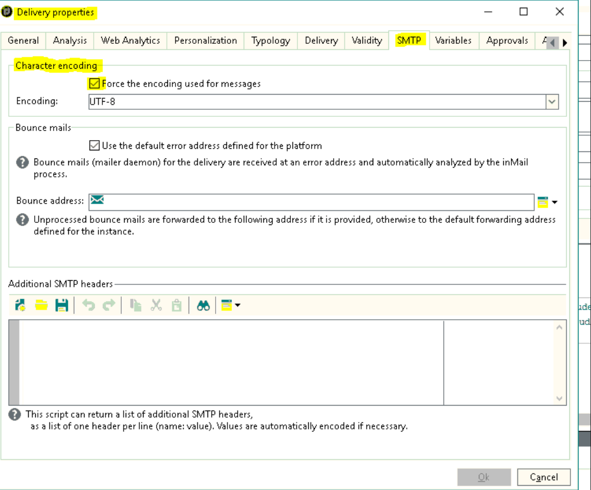

# Los conjuntos de caracteres en la opción de codificación de caracteres SMTP de Campaign no están visibles

## Descripción {#description}


<b>Entorno</b>
Adobe Campaign Classic Adobe Campaign

<b>Problema</b>
Los conjuntos de caracteres de la opción de codificación de caracteres SMTP de Adobe Campaign en las Propiedades de entrega no estaban visibles.

<b>Causa</b>
La causa es que la base de datos no es una base de datos Unicode.


## Resolución {#resolution}


<b>Solución</b>

1. El `XtkDatabaseId` El valor del campo de opción define el ID de la base de datos. Comienza con una &quot;u&quot; para la base de datos Unicode. Consulte la [Lista de opciones del Campaign Classic](https://experienceleague.adobe.com/docs/campaign-classic/using/installing-campaign-classic/appendices/configuring-campaign-options.html) en la documentación de nuestro Campaign Classic en Adobe Experience League para obtener más información.


   
2. Esto significa que, si el ID de la base de datos es Unicode, puede ver lo siguiente:

   
3. Cuando cambie el `XtkDatabaseId` valor en el campo de opción, esa parte no es visible como `IsUnicode()` parte de la condición de no cumplir en el código como se muestra a continuación:


```
container type="visibleGroup" visibleIf="EV(@messageType, 'mail') and IsUnicode()"
                     xpath="advancedParameters"
            container label="Character encoding" type="frame"
              input useDesc="true" xpath="@forceCodepage"/
              container type="visibleGroup" visibleIf="@forceCodepage"
                input xpath="@codepage"/
              /container
            /container
          /container
```


En este ejemplo, la colaboración con la base de datos era &quot;Latin1_General_CI_AS&quot;. De ahí su `XtkDatabaseId` el valor del campo de opción no empezaba por u, y esa es la razón por la que la parte no es visible.

Para obtener más información sobre cómo cambiar a Unicode en bases de datos, consulte [Cambio a Unicode](https://experienceleague.adobe.com/docs/campaign-classic/using/monitoring-campaign-classic/updating-adobe-campaign/switching-to-unicode.html) en la documentación de su Campaign Classic en Adobe Experience League.
