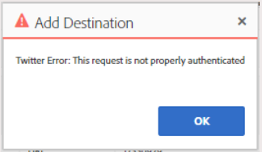

# AAM Error de sincronización de ID de Twitter o de autenticación de devoluciones de destino de

Obtenga información sobre cómo resolver el error de autenticación de Adobe Audience Manager al configurar una sincronización de ID de Twitter AAM o un destino dentro de la.

## Descripción {#description}

<b>Entorno</b>
Adobe Audience Manager

<b>Problema</b>
Al configurar una sincronización de ID de Twitter AAM o un destino en, los usuarios reciben el siguiente error de autenticación:

## Resolución {#resolution}

<b>Solución</b>

Segmentos con (`+` `&` `,` `%` `:` `;` `@` `/` `=` `?` `$`) en su nombre no se puede asignar a un destino de Twitter debido a limitaciones en la API de Twitter.

Al crear el destino de Twitter (o al asignar nuevos segmentos a un destino de Twitter existente), asegúrese de seleccionar solo los segmentos que no tengan estos caracteres.

Si es necesario enviar un segmento al Twitter y tiene estos caracteres en el título, cambie el nombre del segmento antes de asignarlo al Twitter.

[Haga clic aquí para obtener más detalles](https://experienceleague.adobe.com/docs/audience-manager/user-guide/features/destinations/device-based/twitter-tailored-audiences.html?lang=en#segment-mapping-considerations) en nuestra Guía de Adobe Audience Manager en Adobe Experience League.
