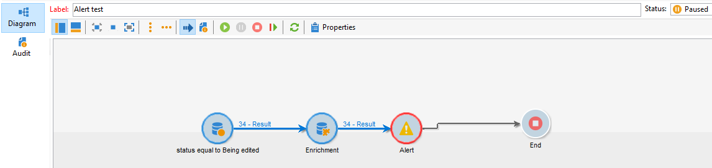
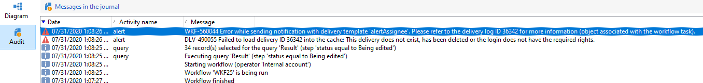

# La actividad de alerta falla cuando se agrega una actividad de enriquecimiento después de una consulta en la tabla de envío

Obtenga información sobre cómo resolver el problema de NEO-25157 en el que se agrega actividad de enriquecimiento cuando se realiza una consulta en el estado de entrega.

## Descripción {#description}

### Entorno

Campaign

### Problema/Síntomas

Obtenga información sobre cómo resolver el problema de NEO-25157 en el que se agrega actividad de enriquecimiento cuando se realiza una consulta en el estado de entrega.

## Resolución {#resolution}

Para resolver el problema, se creó NEO-25157 para I+D y el problema se ha corregido desde entonces en la compilación 9330.

<b>Causa</b>

Este es un error conocido en la compilación 9032, donde se agrega una actividad de enriquecimiento cuando se realiza una consulta<b> </b>se realiza en la tabla de envío en el estado de envío. Independientemente de si el enriquecimiento hace algo o no, la actividad de alerta falla

<b>Éxito sin enriquecimiento:</b>

<b>Fallo con enriquecimiento:</b>

Registros de auditoría: <b>*Error al cargar el ID de entrega \*\*\*\*\* en la caché:....</b>*

