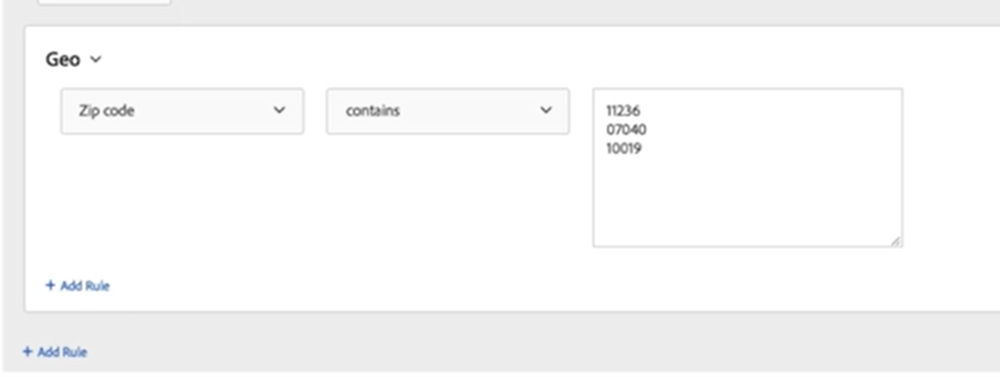

# Target: La calificación de la audiencia geográfica falla con varios parámetros

## Descripción

<b>Entorno</b>

- Adobe Target utiliza la segmentación geográfica para crear una audiencia
- La audiencia utiliza varios parámetros para la segmentación

<b>Problema/Síntomas</b>

La creación de audiencias mediante segmentación geográfica no cumple los requisitos de los visitantes cuando se especifican varios parámetros para la audiencia

## Resolución

<b>Resolución/solución alternativa</b>

Confirme que cada parámetro está en su propia línea en la interfaz de usuario de creación de audiencias: [https://experienceleague.adobe.com/docs/target/using/audiences/create-audiences/categories-audiences/geo.html](https://experienceleague.adobe.com/docs/target/using/audiences/create-audiences/categories-audiences/geo.html?lang=en)

En la captura de pantalla de ejemplo que aparece a continuación, los parámetros se introducen correctamente, mientras que si se escriben como &quot;11236, 07040, 10019&quot;, fallaría.

<b>Causa</b>

Cuando se utilizan varios parámetros, cada uno debe estar en una línea independiente de la interfaz de usuario.  La separación de parámetros mediante una coma, punto y coma u otros signos de puntuación hará que los parámetros se interpreten como un parámetro único y largo.
