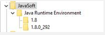

# Error de ACC v7: &quot;JVM-510037 No se encuentra la biblioteca dinámica de Java&quot;.


Hay dos soluciones: puede agregar manualmente la clave JavaSoft al Registro de Windows en `Computer\HKEY_LOCAL_MACHINE\SOFTWARE`o puede utilizar dos variables de entorno de Windows para indicar dónde se encuentra la variable `jvm.dll` El archivo se puede encontrar mediante el módulo web.

## Descripción {#description}


### <b>Entorno</b>

Adobe Campaign Classic v7 (ACC v7)


### <b>Problemas/Síntomas</b>

<b>Caso de uso</b> : Este problema se producía al reemplazar el JDK de Oracle con el JDK abierto en instancias de Campaign que se ejecutaban en Windows.

El caso de ejemplo tenía Oracle JDK v1.8.0.191 instalado en todas las instancias de Windows Campaign. Después de reemplazar el JDK de Oracle por un JDK abierto en una de sus instancias de Campaign, la web no se pudo iniciar y generó el siguiente error:

<b>`JVM-510037 Cannot find the Java dynamic library. Check that a JDK or a JRE is installed on the machine. (iRc=-53)`</b>

Sin embargo, Java se instala correctamente con las variables de entorno Path y JAVA_HOME correctas.


## Resolución {#resolution}


Para ejecutar el módulo web, la biblioteca dinámica JVM debe ser visible para Campaign. Al eliminar el JDK de Oracle, se elimina la clave JavaSoft del registro de Windows y también se pierde cualquier referencia a esa biblioteca JVM.

Hay dos soluciones para resolver este problema:

### <u>#1 de solución</u>

Puede agregar manualmente la clave JavaSoft al Registro de Windows en `Computer\HKEY_LOCAL_MACHINE\SOFTWARE`.



Este es un ejemplo (con `OpenJDK 1.8_292`) de lo que debe agregar:

`Windows Registry Editor Version 5.00`

`[ HKEY_LOCAL_MACHINE\SOFTWARE\JavaSoft]`


```
[ HKEY_LOCAL_MACHINE\SOFTWARE\JavaSoft\Java Runtime Environment] "CurrentVersion"="1.8""BrowserJavaVersion"="11.301.2"
```


```
[ HKEY_LOCAL_MACHINE\SOFTWARE\JavaSoft\Java Runtime Environment\1.8] "MicroVersion"="0""RuntimeLib"="C:\\Users\\perth\\Java\\openjdk-8u292-b10\\jre\\bin\\server\\jvm.dll""JavaHome"="C:\\Users\\perth\\Java\\openjdk-8u292-b10\\jre"
```


```
[ HKEY_LOCAL_MACHINE\SOFTWARE\JavaSoft\Java Runtime Environment\1.8.0_292] "MicroVersion"="0""RuntimeLib"="C:\\Users\\perth\\Java\\openjdk-8u292-b10\\jre\\bin\\server\\jvm.dll""JavaHome"="C:\\Users\\perth\\Java\\openjdk-8u292-b10\\jre"
```


 
Y se ha añadido la siguiente carpeta de ruta a la <b>`Path` </b>variable de entorno.

`C:\Users\perth\Java\openjdk-8u292-b10\bin`

El módulo web debe poder iniciarse según lo esperado:


### <u>#2 de solución</u>

El uso de dos variables de entorno de Windows se puede definir para indicar dónde se encuentra la variable `jvm.dll` El archivo se puede encontrar mediante el módulo web.

Las variables son:

- `USEENV=1`
- `JVMLIBDIR=<the path of the jvm.dll file>`


A continuación, se muestra un ejemplo:


Tenga en cuenta que el uso del `JVMLIBDIR` será visible desde el registro si el registro detallado está habilitado en el módulo web.
