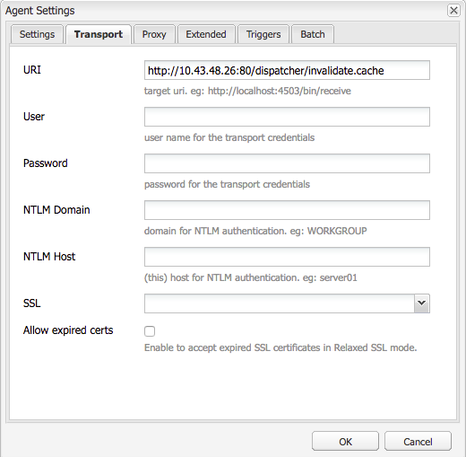

# Adobe Managed Services Vaciado de Dispatcher

Explore los matices de los mecanismos de vaciado de caché y los flujos de trabajo de activación de contenido, vitales para mantener la eficiencia del sistema y la integridad de los datos.

## Descripción {#description}

### <b>Entorno</b>

Experience Manager

### <b>Problema/Síntomas</b>

En este documento se explica cómo se produce el vaciado y el mecanismo que ejecuta el vaciado y la invalidación de la caché.
  Cómo funciona 
<b>Orden de las operaciones</b>

El flujo de trabajo habitual se describe de la mejor manera cuando los autores de contenido activan una página, cuando el editor recibe el nuevo contenido, se déclencheur una solicitud de vaciado para el distribuidor tal y como se muestra en el siguiente diagrama:

Esta sucesión de eventos demuestra que solo vaciamos elementos cuando son nuevos o han sido modificados.  Esto garantiza que el editor ha recibido el contenido antes de borrar la caché para evitar condiciones de carrera donde el vaciado podría ocurrir antes de que el editor pueda seleccionar los cambios.

### <b>Agentes de replicación</b>

En el autor, hay un agente de replicación configurado para indicar al editor que cuando algo se activa, tiene el déclencheur de enviar el archivo y todas sus dependencias al editor.

Cuando el editor recibe el archivo, tiene un agente de replicación configurado para indicar qué distribuidor almacena en déclencheur el evento de recepción.  Entonces, se serializa una solicitud de vaciado y se publica en el distribuidor.

#### AGENTE DE REPLICACIÓN DE AUTOR

Estas son algunas capturas de pantalla de un agente de replicación estándar configurado:

Normalmente, hay uno o dos agentes de replicación configurados en el autor para cada editor para el que replican contenido.

Primero, tenemos el agente de replicación estándar que genera activaciones del contenido.

Segundo, el agente inverso.  Este es opcional y está configurado para comprobar la bandeja de salida de cada editor con el fin de ver si hay contenido nuevo que introducir en la interfaz de autor como actividad de replicación inversa

#### AGENTE DE REPLICACIÓN DEL EDITOR

Estas son algunas capturas de pantalla de un agente de replicación de vaciado estándar configurado:

#### DISPATCHER VACÍA LA REPLICACIÓN RECIBIENDO HOST VIRTUAL

El módulo de Dispatcher busca encabezados particulares para saber cuándo una solicitud de POST AEM se tiene que pasar a los procesamientos o si está serializada como una solicitud de vaciado y la debe administrar el propio controlador de Dispatcher.  A continuación, se muestra una captura de pantalla de la página de configuración que muestra estos valores:

La página de configuración predeterminada muestra <b>Tipo de serialización</b> as *Vaciado de Dispatcher* y establece el nivel de error:

En la pestaña de transporte, puede ver que el URI se ha configurado para indicar la dirección IP del distribuidor que recibirá las solicitudes de vaciado.  La ruta /dispatcher/invalidate.cache no es la manera en la que el módulo determina si hay vaciado. Solo es un punto final obvio que se puede ver en el registro de acceso para saber si se produjo una solicitud de vaciado.  En la pestaña Ampliado, veremos qué elementos permiten comprobar que se trata de una solicitud de vaciado para el módulo del distribuidor.

El método HTTP para solicitudes de vaciado es solo una solicitud de GET con algunos encabezados especiales:

- CQ-Action

  AEM Esto utiliza una variable de basada en la solicitud y el valor es normalmente *activar o eliminar* 

- AEM CQ-Handle: Utiliza una variable de tipo de datos basada en la solicitud y el valor es normalmente la ruta completa al elemento vaciado, por ejemplo */content/dam/logo.jpg*

- CQ-Path

  AEM Esto utiliza una variable de basada en la solicitud y el valor es normalmente toda la ruta al elemento que se está vaciando, por ejemplo */content/dam*

- Host

  Aquí es donde el encabezado del host se suplanta para asignarse a un elemento específico `<` VirtualHost`>`  que se configura en el servidor web Apache del distribuidor (/etc/httpd/conf.d/enabled_vhosts/aem_flush.vhost).  Es un valor codificado que coincide con una entrada en el archivo aem_flush.vhost *ServerName* o *ServerAlias*

  

  En la pestaña déclencheur, veremos cuáles son los déclencheur alternados que usamos y cuáles son

- <b>Ignorar predeterminado</b>

  Esto está habilitado para que el agente de replicación no se active cuando se activa una página.  Esto es algo que, cuando una instancia de autor tenía que realizar un cambio en una página, almacenaba en déclencheur un vaciado.  Déclencheur Como este es un editor, no queremos desactivar ese tipo de evento.

- <b>Recepción activada</b>

  Cuando se recibe un nuevo archivo, queremos almacenar en déclencheur un vaciado.  Por lo tanto, cuando el autor nos envíe un archivo actualizado, almacenaremos en déclencheur y enviaremos una solicitud de vaciado al distribuidor.

- <b>Sin versiones</b>

  Comprobamos esto para evitar que el editor genere nuevas versiones porque se recibió un nuevo archivo.  Solo reemplazaremos el archivo que tenemos y confiaremos en que el autor mantenga un seguimiento de las versiones en lugar del editor.

Ahora, si miramos el aspecto habitual de una solicitud de vaciado en forma de comando de flexión,
          

| `$ curl \``-H``"CQ-Action: Activate"` `\``-H``"CQ-Handle: /content/dam/logo.jpg"` `\``-H``"CQ-Path: /content/dam/"` `\``-H``"Content-Length: 0"` `\``-H``"Content-Type: application/octect-stream"` `\``-H``"Host: flush"` `\``http:``//10``.43.0.32:80``/dispatcher/invalidate``.cache` |
| --- |

Este ejemplo vaciaría la ruta /content/dam al actualizar el archivo .stat en ese directorio.

### El archivo .stat

El mecanismo de vaciado es sencillo y queremos explicar la importancia de la <b>.stat</b> archivos que se generan en la raíz del documento donde se crean los archivos de caché.

Dentro de los archivos .vhost y _farm.any, configuramos una directiva raíz de documento para especificar dónde se encuentra la caché y dónde almacenar o entregar los archivos cuando llega una solicitud de un usuario final.

Si tuviera que ejecutar el siguiente comando en el servidor de Dispatcher, empezaría por buscar los archivos .stat.

| 1 | `$``find` `/mnt/var/www/html/` `-``type` `f -name``".stat"` |
| --- | --- |

#### Este diagrama muestra el aspecto de la estructura de este archivo cuando tenga elementos en la caché y haya enviado una solicitud de vaciado y procesado el módulo del distribuidor:

#### 

 NIVEL DE ARCHIVO ESTADÍSTICO

Observe que en cada directorio había un archivo .stat.  Esto indica que se ha producido un vaciado.  En el ejemplo anterior, la variable <b>nivel de archivo .stat</b> la configuración se estableció en <b>3</b> dentro del archivo de configuración de granja correspondiente.

La configuración del nivel del archivo .stat indica cuántas carpetas profundas del módulo atravesarán y actualizarán un archivo .stat.  El archivo .stat está vacío. No es más que un nombre de archivo con una marca de fecha e incluso se podría crear manualmente ejecutando el comando táctil en la línea de comandos del servidor de Dispatcher.

Si la configuración del nivel del archivo .stat está establecida demasiado alta, cada solicitud de vaciado atravesará el árbol de directorios tocando los archivos .stat.  Esto puede derivar en una gran disminución del rendimiento en árboles de caché grandes y afectar al rendimiento general de su distribuidor.

Configurar este nivel de archivo demasiado bajo puede provocar que una solicitud de vaciado limpie más de lo necesario.  Lo que, a su vez, haría que la caché se perdiera con más frecuencia, con menos solicitudes recibidas desde la caché y podría causar problemas de rendimiento.

Nota:

Establezca statfilelevel en un nivel razonable.  Observe la estructura de carpetas y asegúrese de que está configurada para permitir vaciados concisos sin tener que atravesar demasiados directorios.   Pruébelo y asegúrese de que se adapta a sus necesidades durante una prueba de rendimiento del sistema.

Un buen ejemplo es un sitio que admite diferentes idiomas.  El típico árbol de contenido tendría los siguientes directorios

/content/brand1/en/us/

En este ejemplo, utilice una configuración de nivel de archivo .stat de 4.  Esto le garantizará que cuando vacíe contenido que se encuentre debajo de <b>us</b> que no hará que las carpetas de idioma se vacíen también.

#### PROTOCOLO DE ENLACE CON MARCA DE TIEMPO DEL ARCHIVO STAT

Cuando llega una solicitud de contenido, se repite el mismo proceso

1. La marca de tiempo del archivo .stat se compara con la del archivo solicitado
2. AEM Si el archivo .stat es más reciente que el archivo solicitado, se elimina el contenido de la caché y se busca uno nuevo en la caché de los archivos y se almacena en la caché de los archivos que se han guardado en la caché.  A continuación, se sirve el contenido
3. Si el archivo .stat es más antiguo que el archivo solicitado, entonces se sabe que el archivo es nuevo y se puede servir el contenido.

#### PROTOCOLO DE ENLACE DE CACHÉ: EJEMPLO 1

En el ejemplo anterior, una solicitud para el contenido /content/index.html

La fecha del archivo index.html es 2019-11-01 @ 18:21 h

La fecha del archivo .stat más cercano es 2019-11-01 @ 12:22 h

Si tenemos en cuenta lo que hemos leído anteriormente, puede ver que el archivo del índice es más reciente que el archivo .stat y se entregará desde la caché al usuario final que lo solicitó

#### PROTOCOLO DE ENLACE DE CACHÉ: EJEMPLO 2

En el ejemplo anterior, una solicitud para el contenido /content/dam/logo.jpg

La fecha del archivo logo.jpg es 2019-10-31 @ 13:13 h

La fecha del archivo .stat más cercano es 2019-11-01 @ 12:22 h

AEM Como puede ver en este ejemplo, el archivo es más antiguo que el archivo .stat y se eliminará. Uno más reciente se sacará de la caché para reemplazarlo en la caché antes de entregárselo al usuario final que lo solicitó.
    Configuración de archivo de granja    
Puede acceder a toda la documentación sobre el conjunto completo de opciones de configuración aquí: [https://docs.adobe.com/content/help/en/experience-manager-dispatcher/using/configuring/dispatcher-configuration.html#configuring-dispatcher_configuring-the-dispatcher-cache-cache](https://docs.adobe.com/content/help/en/experience-manager-dispatcher/using/configuring/dispatcher-configuration.html#configuring-dispatcher_configuring-the-dispatcher-cache-cache)

Nos gustaría destacar algunas de ellas que están relacionadas con el vaciado de caché

### Raíz de documento

Esta entrada de configuración se encuentra en la siguiente sección del archivo de granja:
          

| `/myfarm {``    ``/cache {``        ``/docroot` |
| --- |

Especifique el directorio en el que desea que se rellene Dispatcher y se administre como directorio de caché.

Nota:

Este directorio debe coincidir con la configuración de la raíz del documento de Apache para el dominio que su servidor web pueda usar.

Tener carpetas docroot anidadas para cada granja que se encuentra en subcarpetas de la raíz del documento de Apache es una idea terrible por muchas razones.

### Nivel de archivos estáticos

Esta entrada de configuración se encuentra en la siguiente sección del archivo de granja:
          

| `/myfarm {``    ``/cache {``        ``/statfileslevel` |
| --- |

        
Esta configuración indica cómo de profundos deberían ser los archivos .stat cuando llega una solicitud de vaciado.

/statfileslevel configurado en el siguiente número con la raíz del documento de /var/www/html/ tendría los siguientes resultados al vaciar /content/dam/brand1/en/us/logo.jpg

- 0: Se crearían los siguientes archivos .stat.
   - /var/www/html/.stat
- 1: Se crearían los siguientes archivos .stat.
   - /var/www/html/.stat
   - /var/www/html/content/.stat
- 2: Se crearían los siguientes archivos .stat.
   - /var/www/html/.stat
   - /var/www/html/content/.stat
   - /var/www/html/content/dam/.stat
- 3: Se crearían los siguientes archivos .stat.

   - /var/www/html/.stat
   - /var/www/html/content/.stat
   - /var/www/html/content/dam/.stat
   - /var/www/html/content/dam/brand1/.stat
- 4: Se crearían los siguientes archivos .stat.

   - /var/www/html/.stat
   - /var/www/html/content/.stat
   - /var/www/html/content/dam/.stat
   - /var/www/html/content/dam/brand1/.stat
   - /var/www/html/content/dam/brand1/en/.stat
- 5: Se crearían los siguientes archivos .stat.

   - /var/www/html/.stat
   - /var/www/html/content/.stat
   - /var/www/html/content/dam/.stat
   - /var/www/html/content/dam/brand1/.stat
   - /var/www/html/content/damn/brand1/en/.stat
   - /var/www/html/content/damn/brand1/en/us/.stat

Nota:

Tenga en cuenta que cuando el protocolo de enlace de marca de tiempo se produce, busca el archivo .stat más cercano.

Tener un archivo .stat al nivel 0 y un archivo .stat solo en /var/www/html/.stat significa que el contenido que se encuentra en /var/www/html/content/dam/brand1/en/us/ buscará el archivo .stat más cercano y atravesará 5 carpetas para encontrar el único archivo .stat que existe en el nivel 0 y comparará las fechas con eso.  Lo que significa que un vaciado a un nivel tan alto sencillamente invalidaría todos los elementos almacenados en la caché.

### Invalidación permitida

Esta entrada de configuración se encuentra en la siguiente sección del archivo de granja:
          

| `/myfarm {``    ``/cache {``        ``/allowedClients {` |
| --- |

Dentro de esta configuración es donde se coloca una lista de direcciones IP permitidas para enviar solicitudes de vaciado.  Si una solicitud de vaciado llega al despachante debe hacerlo desde una IP de confianza.  Si tiene esto mal configurado o envía una solicitud de vaciado desde una dirección IP que no es de confianza, verá el siguiente error en el archivo de registro:
          

| `[ Mon Nov 11 22:43:05 2019]  [ W]  [ pid 3079 (tid 139859875088128)]  Flushing rejected from 10.43.0.57` |
| --- |

### Reglas de invalidación

Esta entrada de configuración se encuentra en la siguiente sección del archivo de granja:
          

| `/myfarm {``    ``/cache {``        ``/invalidate {` |
| --- |

Estas reglas indican normalmente qué archivos se pueden invalidar con una solicitud de vaciado.

Para evitar que archivos importantes se invaliden con una activación de página, puede poner en juego reglas que especifiquen qué archivos son adecuados para invalidar y cuáles deben invalidarse manualmente.  Este es un ejemplo de conjunto de configuración que solo permite invalidar los archivos HTML:
          

| `/invalidate {``   ``/0000 { /glob "*" /type "deny" }``   ``/0001 { /glob "*.html" /type "allow" }``}` |
| --- |

        

## Resolución {#resolution}

Pruebas/solución de problemas 
Cuando activa una página y se asegura de que la activación de la página se ha realizado correctamente, debería esperar que el contenido que ha activado se vaya a vaciar también de la caché.

Actualiza tu página y ve el material antiguo y hay luz verde.

Vamos a seguir algunos pasos manuales del proceso de vaciado para obtener información sobre qué puede estar mal.  Desde el shell del editor, ejecute la siguiente solicitud de vaciado usando curl:

   

| `$ curl -H``"CQ-Action: Activate"` `\``-H``"CQ-Handle: /content/<PATH TO ITEM TO FLUSH>"` `\``-H``"CQ-Path: /content/<PATH TO ITEM TO FLUSH>"` `\``-H``"Content-Length: 0"` `-H``"Content-Type: application/octet-stream"` `\``-H``"Host: flush"` `\``http:``//``<DISPATCHER IP ADDRESS>``/dispatcher/invalidate``.cache` |
| --- |

Ejemplo de solicitud de vaciado de prueba
   

| `$ curl -H``"CQ-Action: Activate"` `\``-H``"CQ-Handle: /content/customer/en-us"` `\``-H``"CQ-Path: /content/customer/en-us"` `\``-H``"Content-Length: 0"` `-H``"Content-Type: application/octet-stream"` `\``-H``"Host: flush"` `\``http:``//169``.254.196.222``/dispatcher/invalidate``.cache` |
| --- |

Una vez que haya enviado el comando de solicitud al distribuidor, querrá ver qué ha sucedido en los registros y en los archivos .stat.  Siga el archivo de registro y debería ver las siguientes entradas para confirmar que la solicitud de vaciado llegue al módulo del distribuidor
   

| `[ Wed Nov 13 16:54:12 2019]  [ I]  [ pid 19173:tid 140542721578752]  Activation detected: action=Activate [ /content/dam/logo.jpg]``[ Wed Nov 13 16:54:12 2019]  [ I]  [ pid 19173:tid 140542721578752]  Touched /mnt/var/www/html/.stat``[ Wed Nov 13 16:54:12 2019]  [ I]  [ pid 19173:tid 140542721578752]  Touched /mnt/var/www/html/content/.stat``[ Wed Nov 13 16:54:12 2019]  [ I]  [ pid 19173:tid 140542721578752]  Touched /mnt/var/www/html/content/dam/.stat``[ Wed Nov 13 16:54:12 2019]  [ I]  [ pid 19173:tid 140542721578752]  "GET /dispatcher/invalidate.cache" 200 purge [ publishfarm/-]  0ms` |
| --- |

Ahora que vemos que el módulo recibió y confirmó la solicitud de vaciado, necesitamos saber de qué manera ha afectado a los archivos .stat.  Ejecute el siguiente comando y observe cómo se actualizan las marcas de tiempo mientras emite otro vaciado:
   

| `$``watch` `-n 3``"find /mnt/var/www/html/ -type f -name "``.stat``" | xargs ls -la $1"` |
| --- |

Como puede ver en el resultado del comando, las marcas de tiempo de los archivos .stat actuales
   

| `-rw-r--r--. 1 apache apache 0 Nov 13 16:54``/mnt/var/www/html/content/dam/``.stat``-rw-r--r--. 1 apache apache 0 Nov 13 16:54``/mnt/var/www/html/content/``.stat``-rw-r--r--. 1 apache apache 0 Nov 13 16:54``/mnt/var/www/html/``.stat` |
| --- |

Ahora, si volvemos a ejecutar el vaciado, verá cómo se actualizan las marcas de tiempo
   

| `-rw-r--r--. 1 apache apache 0 Nov 13 17:17``/mnt/var/www/html/content/dam/``.stat``-rw-r--r--. 1 apache apache 0 Nov 13 17:17``/mnt/var/www/html/content/``.stat``-rw-r--r--. 1 apache apache 0 Nov 13 17:17``/mnt/var/www/html/``.stat` |
| --- |

Vamos a comparar las marcas de tiempo del contenido con las de nuestros archivos .stat
   

| `$ stat``/mnt/var/www/html/content/customer/en-us/``.stat``  ``File: `.stat&#39;``  ``Tamaño: 0 Bloques: 0 Bloque de E/S: 4096 normal vacío``file``Dispositivo: ca90h``/51856d`    `Inode: 17154125    Links: 1``Acceso: (0644)``/-rw-r--r--``) Uid: ( 48/ apache) Gid: ( 48/ apache)``Access: 2019-11-13 16:22:31.000000000 -0400``Modificar: 16-11-2019:22:31,000000000 -0400``Change: 2019-11-13 16:22:31.000000000 -0400`   `$ stat``/mnt/var/www/html/content/customer/en-us/logo``.jpg``Archivo: `logo.jpg'``  ``Size: 15856           Blocks: 32          IO Block: 4096   regular``file``Device: ca90h``/51856d`    `Inode: 9175290    Links: 1``Access: (0644``/-rw-r--r--``)  Uid: (   48/  apache)   Gid: (   48/  apache)``Access: 2019-11-11 22:41:59.642450601 +0000``Modify: 2019-11-11 22:41:59.642450601 +0000``Change: 2019-11-11 22:41:59.642450601 +0000` |
| --- |

Si mira cualquiera de las marcas de tiempo, verá que el contenido tiene una hora más reciente que el archivo .stat, lo que indica al módulo ofrecer el archivo de la caché porque es más reciente que el archivo .stat.

En pocas palabras, algo actualizó las marcas de tiempo de este archivo que no cumple los requisitos para &quot;vaciarlo&quot; o reemplazarlo.
