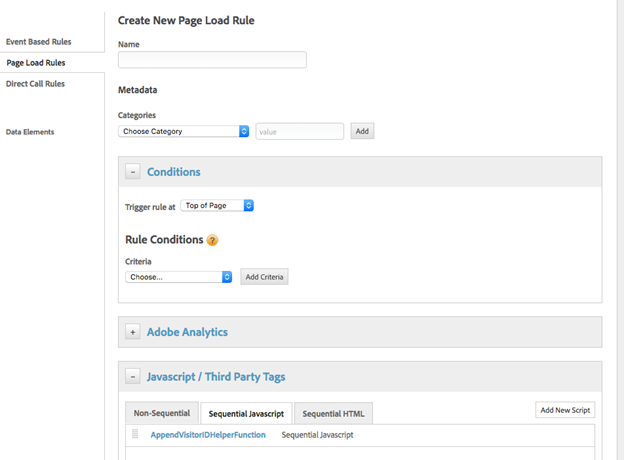

# Cómo establecer la función de ayuda del servicio de ID de Marketing Cloud en el Administrador dinámico de etiquetas de Adobe


Esta es una guía detallada para establecer la función de ayuda del servicio de ID de Marketing Cloud en el Administrador dinámico de etiquetas de Adobe.

## Descripción {#description}


### <b>Entorno</b>

Adobe Experience Cloud

### <b>Problema/Síntomas</b>

Este artículo explica la implementación del Servicio de Adobe Marketing Cloud ID [Función para adjuntar un ID de visitante](https://experienceleague.adobe.com/docs/id-service/using/id-service-api/methods/appendvisitorid.html?lang=es) en Adobe Dynamic Tag Management (DTM).

<b>Nota:</b> Cargar el servicio de ID de Marketing Cloud VisitorAPI.js 1.8.0 o superior en el [Servicio de ID de Marketing Cloud DTM](https://experienceleague.adobe.com/docs/id-service/using/id-service-api/methods/getmcvid.html) en los dominios de origen y de destino. Las pruebas deben realizarse en situaciones de explorador que bloqueen cookies para validar la funcionalidad.


## Resolución {#resolution}


### <b>Configuración - Dominio A</b>

Establezca el dominio de destino (dominio B) en una regla secuencial de carga de página superior con un JavaScript de terceros personalizado en el dominio A.

Vea las capturas de pantalla a continuación como ejemplo:




```clike
//Code on Domain A
var domainB = "www.domainb.com";
 
//Call the ID service
var visitor = Visitor.getInstance ("Insert Marketing Cloud organization ID here",{
trackingServer:"Insert tracking server here here", //Same as s.trackingServer
trackingServerSecure: "Insert secure tracking server here", //Same as s.trackingServerSecure
...
//Other getInstance variables here
...
});
 
//Add the helper function
var domainBWithVisitorIDs = visitor.appendVisitorIDsTo(domainB);
 
//Redirect to Domain B
window.location = _satellite.getVisitorId().appendVisitorIDsTo(domainB)
```


<b>Nota:</b> Para redirigir a una ruta más explícita, la configuración de dominio debe reflejar esa intención. Si las redirecciones requieren una construcción más dinámica, se puede agregar el código personalizado a un elemento de datos o a una regla de llamada directa. Por ejemplo: `var domainB = "http://www.domainb.com/products/"`

### <b>Verificar: dominio B</b>

Vaya del dominio A al dominio B. Compruebe que el MID del dominio B coincida con el MID del dominio A llamando a lo siguiente en Developer Console:  `_satellite.getVisitorId().getMarketingCloudVisitorID()().appendVisitorIDsTo(domainB)`
