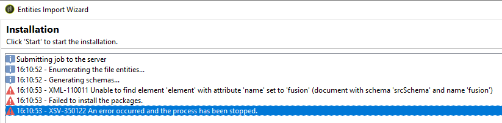

# Obteniendo XML-110011 No se puede encontrar el elemento &quot;fusion&quot;

## Descripción {#description}

<b>Entorno</b>
Campaign Classic V7

<b>Problema/Síntomas</b>
<u>Para usuarios locales</u>

Después de actualizar una instancia de Campaign a ACC-21.1 compilación 9342 o superior, al intentar instalar cualquier paquete de Campaign, se produce el siguiente error:
 

## Resolución {#resolution}

El esquema de fusión (`xtk:fusion`) debe eliminarse en el proceso de posactualización. Pero en algunos casos, el esquema sigue presente.

Al consultar la base de datos de la siguiente manera, puede ver los siguientes registros:

Para eliminar el esquema xtk:fusion, debe ejecutar la herramienta postactualización con la opción &quot;-force&quot;:

`nlserver config -postupgrade -allinstances -force`

Debería ver lo siguiente:

Si el esquema sigue presente, puede intentarlo con la variable `"-force -repair"` opciones:

`nlserver config -postupgrade -allinstances -force -repair`

Si sigue sin funcionar, es posible que tenga que quitar manualmente los registros de la base de datos.
