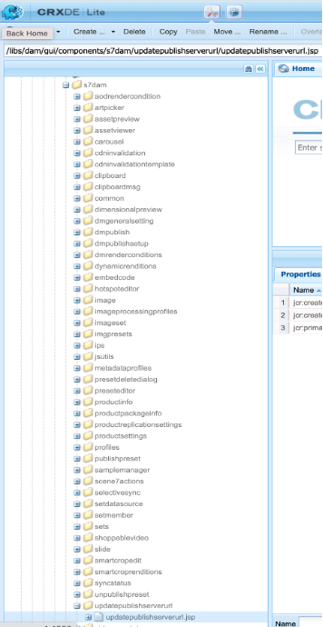

# Cambio de la URL de Dynamic Media para DM Assets

El artículo explica cómo cambiar la URL de Dynamic Media para los recursos DM.

## Descripción {#description}

### Entorno

- Experience Manager Assets
- Experience Manager 6.5

### Problema/Síntomas

En la instancia de autor de Adobe Experience Manager AEM () (versión 6.5.11 y posteriores), puede utilizar la sección Configuración general para configurar el servidor DM y cambiar la URL del servidor de publicación o la URL de Dynamic Media para los recursos DM.

Para abrir la página Configuración general de Dynamic Media AEM, en la instancia de autor de la instancia de, haga clic en <b>Herramientas</b>, luego vaya a <b>Assets</b>, luego vaya a <b>Configuración general de Dynamic Media</b>.

Asegúrese de haber configurado Dynamic Media AEM en la instancia de autor de la. Haga clic en <b>Herramientas</b>, luego vaya a<b> Cloud Service</b> a continuación, vaya a <b>Configuración de Dynamic Media</b>.

El nombre de servidor publicado es un servidor de red de distribución de contenido (CDN) que se utiliza en todas las llamadas URL generadas por el sistema específicas a su cuenta de Dynamic Media.

Asegúrese de que el nombre de dominio personalizado esté asignado al servidor de red de distribución de contenido (CDN) de Adobe o, en caso de que utilice el nombre de dominio de su propio proveedor de CDN, debe estar asignado a nuestro servidor de origen\*

\*Póngase en contacto con el Soporte técnico de Dynamic Media de Adobe para obtener más información.

## Resolución {#resolution}

Una vez que haya cambiado el Nombre del servidor publicado, guarde los cambios. No cambiar <b>Servidor de origen</b> a menos que así lo indique un técnico de soporte de Dynamic Media de Adobe.

Instrucciones para cambiar el nombre del servidor publicado para los componentes de Dynamic Media existentes en las páginas de Sites:

- Instale el paquete adjunto para crear el nodo URL del servidor de publicación
- AEM Una vez instalado el paquete, verá que se han creado 2 archivos en su Autor de la

   - [/libs/dam/gui/content/s7dam/updatepublishserverurl](http://vgaur-wx-1:4502/crx/de/index.jsp#/crx.default/jcr%3aroot/libs/dam/gui/content/s7dam/updatepublishserverurl "Ver ruta en el CRXDE Lite")
   - [/libs/dam/gui/components/s7dam/updatepublishserverurl/updatepublishserverurl.js](http://vgaur-wx-1:4502/crx/de/index.jsp#/crx.default/jcr%3aroot/libs/dam/gui/components/s7dam/updatepublishserverurl/updatepublishserverurl.jsp "Ver ruta en el CRXDE Lite")p

.         

- &#x200B;&#x200B;&#x200B;&#x200B;&#x200B; Introduzca su ruta de AEM Sites en el parámetro &quot;ruta&quot; de esta URL : http://`<` aem-server`>` :portnumber/libs/dam/gui/content/s7dam/updatepublishserverurl.html?path=/content/mysite&amp;update=true&#x200B;&#x200B;&#x200B;&#x200B;&#x200B;&#x200B;&#x200B;
- Al servir esa URL, se actualizarán automáticamente las URL de DM de todos los componentes de Dynamic Media en todas las páginas de Sites de la ruta de AEM Sites mencionada y se mostrará este tipo de salida

Todas las direcciones URL de los componentes de Dynamic Media AEM se cambiarán al nuevo nombre de servidor publicado para el sitio de.
Vista del componente DM, con el nombre de servidor publicado antiguo

Esta es la vista del componente DM, el nombre del servidor publicado cambia después de visitar esta URL : http://`<` aem-server`>` :portnumber/libs/dam/gui/content/s7dam/updatepublishserverurl.html?path=/content/mysite&amp;update=true

Nota: Para obtener una lista de todos los componentes de Dynamic Media en la ruta de AEM Sites, puede llamar a esta URL: <u style="text-decoration:underline">http://`<` aem-server`>` :portnumber/libs/dam/gui/content/s7dam/updatepublishserverurl.html?path=/content/mysite</u>

&#x200B;&#x200B;&#x200B;&#x200B;&#x200B;&#x200B;
