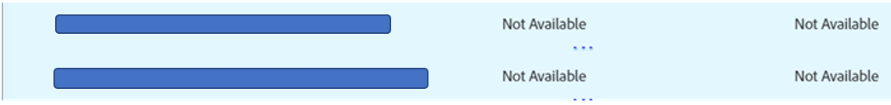

# AAM Solución de problemas de modelos en la IU de la cuando no se pueden guardar u obtener errores

Aprenda por qué no puede guardar el modelo en la interfaz de usuario del cliente de Adobe Audience Manager AAM () aunque no se haya alcanzado el límite de modelos.

## Descripción {#description}

### <b>Entorno</b>

Audience Manager

### <b>Problema/Síntomas</b>

<b>Problema 1:</b> AAM No puede guardar el modelo en la interfaz de usuario de la interfaz de usuario del cliente aunque no se haya alcanzado el límite de modelos. Además, al guardar el modelo, no se muestran errores. Al hacer clic en <b>Guardar</b> botón, no pasa nada.

<b>Problema 2: </b>AAM No puede desactivar o eliminar el modelo en la interfaz de usuario del cliente de la. Al desactivar o eliminar, aparece el error *Se ha revocado el acceso a este rasgo.* Consulte la siguiente captura de pantalla.

## Resolución {#resolution}

<b>Solución 1:</b> Compruebe todos los rasgos utilizados por los segmentos en el modelo. Es posible que encuentre un rasgo que se haya tomado de Audience Marketplace, pero no se ha habilitado una suscripción para el modelado para los rasgos que está utilizando en su modelo. En este caso, no debería poder guardar el modelo. Para guardar el modelo, elimine todos esos rasgos o habilite la suscripción para el modelado de estos rasgos. Tenga en cuenta que, en caso de que desee habilitar la suscripción para el modelado, es posible que tenga que pagar cargos adicionales por ello.

<b>Solución 2: </b>Una de las posibles formas de superar este problema:

Compruebe todos los rasgos utilizados por los segmentos en el modelo que desea desactivar o eliminar. Puede haber una posibilidad de que encuentre un rasgo que no esté disponible. Vea la siguiente captura de pantalla:

Elimine todos los rasgos que no estén disponibles y, a continuación, intente desactivar o eliminar el modelo. Ahora, es posible que pueda desactivar o eliminar correctamente el modelo.

*Nota: Cuando reciba un mensaje de error en la interfaz de usuario, es posible que desee habilitar las herramientas para desarrolladores al utilizar Chrome y seleccionar la pestaña de red e intentar replicar de nuevo la acción anterior. Es probable que las herramientas para desarrolladores presenten más detalles, incluidas las dependencias que impiden completar las acciones. Esto puede ayudarle a comprender el motivo por el que se produce un error de IU.*
