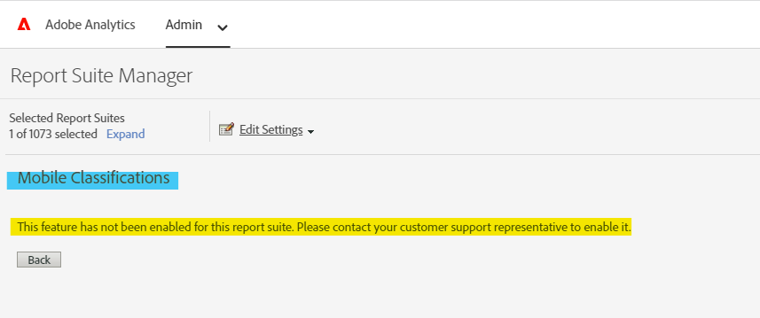

# Habilitar/activar la clasificación para dimensiones de aplicaciones móviles

## Descripción {#description}

<b>Entorno</b>
- Customer Journey Analytics
- Analytics

<b>Problemas/Síntomas</b>
Generalmente, al acceder a las clasificaciones móviles en el Administrador de grupos de informes - Administración de aplicaciones - Clasificación de aplicaciones puede mostrar el mensaje mencionado a continuación -

Clasificaciones móviles: &#39;*Esta característica no se ha habilitado para este grupo de informes. Póngase en contacto con su representante de asistencia al cliente para habilitarlo.*&#39; (ver abajo).

Para habilitar la clasificación para dimensiones de aplicaciones móviles, el usuario primero debe habilitar &quot;Informes de aplicaciones&quot; para ese grupo de informes.

## Resolución {#resolution}

<b>Requisitos previos</b>: Derechos de administrador de productos. <b>Habilite la creación de informes de aplicación siguiendo los pasos que se indican a continuación:</b>
- Vaya a Analytics - Administración - Grupo de informes y seleccione el grupo de informes deseado. Vaya a Editar configuración - Administración de aplicaciones -<b> </b>Informes de aplicaciones en el Administrador de grupos de informes.
- Haga clic en &quot;<b>*Habilitar los informes de aplicaciones más recientes</b>*.&quot; En función de sus necesidades, también puede habilitar otros.

   
 
- Después de activarlo, aparece un ping de confirmación.

Después de un tiempo, habrá disponibles nuevas credenciales de inicio de sesión en la página Adobe Analytics y Clasificación de aplicaciones móviles (Editar configuración - Administración de aplicaciones - Clasificaciones de aplicaciones).

Para obtener más información sobre la administración de aplicaciones, haga clic en [here](https://nam04.safelinks.protection.outlook.com/?url=https%3A%2F%2Fexperienceleague.adobe.com%2Fdocs%2Fanalytics%2Fadmin%2Fadmin-tools%2Fmobile-management.html%3Flang%3Den&amp;amp;data=04%7C01%7Cnilotpalb%40adobe.com%7C3c1d5032d121424be46208d9f1d8905c%7Cfa7b1b5a7b34438794aed2c178decee1%7C0%7C0%7C637806734700482559%7CUnknown%7CTWFpbGZsb3d8eyJWIjoiMC4wLjAwMDAiLCJQIjoiV2luMzIiLCJBTiI6Ik1haWwiLCJXVCI6Mn0%3D%7C3000&amp;amp;sdata=uxWerDD%2FHHZVSk%2B6eY0p2czXyW3BtXq75lRarjebwak%3D&amp;amp;reserved=0 "Haga clic en el siguiente vínculo: https://experienceleague.adobe.com/docs/analytics/admin/admin-tools/mobile-management.html?lang=en").
