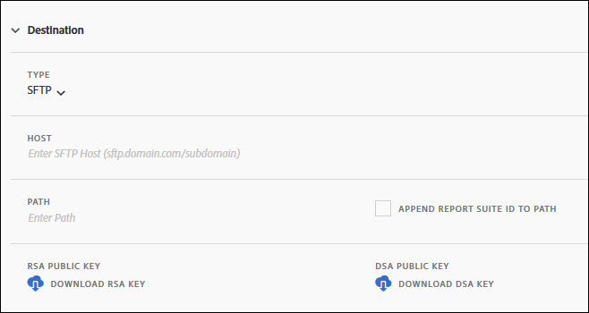

# Cómo obtener las &quot;authorized_keys&quot; en la solicitud de Data Warehouse al servidor SFTP

## Descripción {#description}

<b>Entorno</b>
- Customer Journey Analytics
- Analytics

<b>Problemas/Síntomas</b> Adobe Analytics admite la exportación de solicitudes de Data Warehouse a un servidor SFTP, pero ¿dónde obtener los &quot;authorized_keys&quot; necesarios para ello? 
・Enviar solicitudes de Data Warehouse a servidores SFTP
[https://experienceleague.adobe.com/docs/analytics/export/ftp-and-sftp/secure-file-transfer-protocol/ftp-sftp-dw.html?lang=es](https://experienceleague.adobe.com/docs/analytics/export/ftp-and-sftp/secure-file-transfer-protocol/ftp-sftp-dw.html?lang=es)

## Resolución {#resolution}

El archivo &quot;authorized_keys&quot; se puede descargar desde la pantalla Fuente de datos en Adobe Analytics. Este archivo &quot;authorized_keys&quot; también puede usarse en Data Warehouse.

Cómo obtener el archivo &quot;authorized_keys&quot;:

1. Vaya a la<b>Administrador</b>&quot; en Adobe Analytics y haga clic en &quot;<b>Fuentes de datos</b>&quot;.
2. Haga clic en el<b>Agregar</b>&quot; en la esquina superior izquierda de la lista Fuente de datos.
3. Cuando la variable<b>Nueva fuente de datos</b>&quot;, cambie la &quot;<b>Hasta</b>&quot;<b>Tipo</b>&quot; de &quot;<b>FTP</b>&quot; a &quot;<b>SFTP</b>.&quot;
4. En la parte inferior del &quot;<b>Destino</b>&quot;, el<b>Clave pública RSA</b>&quot; y &quot;<b>Clave pública de DSA</b>&quot; aparecerán.
5. Haga clic en &quot;<b>Descargar clave RSA</b>&quot; o &quot;<b>Descargar clave DSA</b>&quot; para descargar la clave según su entorno.

・Crear o editar una fuente de datos
[https://experienceleague.adobe.com/docs/analytics/export/analytics-data-feed/create-feed.html?lang=es#sftp](https://experienceleague.adobe.com/docs/analytics/export/analytics-data-feed/create-feed.html?lang=es#sftp)
