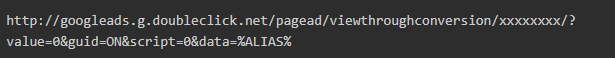

# Destino de Google AAM:

Obtenga información sobre cómo configurar el destino de la URL en detalle en este artículo.

## Descripción {#description}

### Entorno

Audience Manager

### Problema/Síntomas

Este artículo ofrece detalles sobre 4 consultas principales.

1. Cuántos tipos de integración tiene Google.
2. Cómo configurar el destino S2S (destinos de servidor a servidor).
3. RLSA (listas de remarketing para anuncios de búsqueda).
4. Puntos clave.

## Resolución {#resolution}

<b>Tipos de destinos</b>

Destino S2S

Destino URL

<b>Destino URL: lista de remarketing de Google Ads</b>

Estos son algunos pasos que deben seguirse para configurar el destino de la URL.

- En su cuenta de Google Ads, [creación de una lista de remarketing de sitio web](https://support.google.com/google-ads/answer/2454064?hl=en) y anote su ID de conversión.
- Utilice la siguiente URL como plantilla para la URL base y la URL segura. Sustituya la sección &quot;xxxxxxxx&quot; por su ID de conversión.

- AAM En, cree un destino de URL: siga este vínculo ([Crear un destino de URL](https://experienceleague.adobe.com/en/docs/audience-manager/user-guide/features/destinations/custom-destinations/create-url-destination)).
- En la sección Asignaciones de segmentos de su destino URL, añada el código del paso 2 a los campos URL y URL segura. Agregue al código el prefijo http: and https: in los campos URL y Secure URL, respectivamente.

Tenga en cuenta que hay dos tipos de direcciones URL

- URL básica O código de URL no seguro: comienza con HTTP

- Código de URL seguro: Comience con HTTPS

- Haga clic en Guardar.
- Al asignar un nuevo segmento a este destino en Audience Manager, defina la asignación como <b>aam=segmentID </b>y reemplace <b>segmentID </b>con el ID del segmento respectivo.
- Al definir un bloque en Google Ads, cree una regla que coincida con la asignación definida en el paso 6.

<b>Destino de S2S:</b>

1. Para empezar a crear destinos S2S para Google, se pasará CC o Consultor con el tipo de cuenta. El tipo de cuenta puede ser de los siguientes tipos: INVITE_ADVERTISER , INVITE_PARTNER, DFP, ADX, ADX_PUBLISHER , DFP_BY_GOOGLE, DFP_BY_GOOGLE. Tenga en cuenta también que este tipo debe incluirse en la lista blanca al final de Google. (El usuario puede consultar con el equipo de Google este artículo).
2. Una vez que esto esté disponible en detalle, CC o un consultor pueden crear el destino.

<b>Puntos clave: </b>

- La configuración de destino de Google S2S admitirá la transferencia de datos para los seis tipos de dispositivos siguientes:  <b>web-cookie / iOS-mobile / android-mobile/ Roku / Microsoft / Amazon Fire TV</b>.
- Para crear la dirección URL de la lista de comentarios de Google Ads, asegúrese de utilizar <b>&quot;%ALIAS%&quot;</b> en ambos tipos de direcciones URL. Como se trata de una macro que se reemplazará en tiempo de ejecución.
- Si se produce algún error al crear el destino S2S para Google, compruebe los siguientes puntos.

1. La cuenta debe incluirse en la lista blanca al final de Google.
2. Asegúrese de utilizar los detalles correctos como (Protocolo, Servidores, Formato, Fuente de datos de destino, etc.). Haga referencia al vínculo en el segmento S2S.

