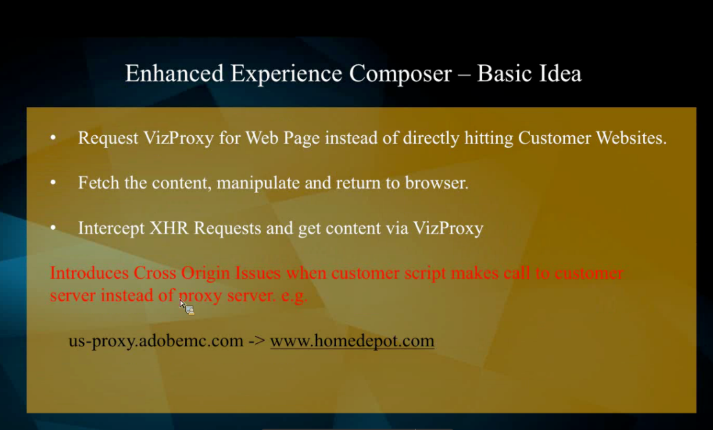

# El dominio de sitio web está bloqueando el Compositor de experiencias mejorado o Acceso denegado al cargar sitios

## Descripción {#description}

### <b>Entorno</b>

Adobe Target

### <b>Problema</b>

Este artículo tiene como objetivo abordar algunos problemas/errores comunes a los que nos enfrentamos en nuestro Compositor de experiencias mejorado de Target, por ejemplo:

- Errores como - &quot;*El dominio del sitio web está bloqueando el Compositor de experiencias mejorado*&quot; o &quot;*acceso denegado*&quot; al cargar sitios con el proxy habilitado
- EEC no carga una URL de control de calidad interna que no es accesible desde una IP pública.
- EEC no carga páginas seguras en su sitio que usa TLS 1.0. (Solo EEC).

## Resolución {#resolution}

<b>Funcionalidad EEC:</b>

### Pasos de solución de problemas de EEC

A. Para errores de EEC como &quot;*El dominio del sitio web está bloqueando el Compositor de experiencias mejorado*&quot; o &quot;*EEC no carga una URL de control de calidad interna que no es accesible desde una IP pública*&quot;

Incluya en la lista blanca los siguientes DNS/IP en caso de que vea *Tiempo de espera* u otros 400 mensajes en estas solicitudes en la red o en el <b>Consola</b> en Herramientas para desarrolladores Chrome:

<b>US:</b>
vizproxy-prod-us-2024941706.us-east-1.elb.amazonaws.com.
54 173 241 58 3 234 111 144

<b>EMEA:</b>
vizproxy-prod-emea-1118976074.eu-west-1.elb.amazonaws.com.
34 246 105 190 34 249 15 238

<b>APAC:</b>
vizproxy-prod-apac-1398366183.ap-northeast-1.elb.amazonaws.com.
52 192 148 53 52 69 47 228

B. Problema de TLS

Siga los siguientes pasos para comprobar la versión TLS del sitio web:

1. Haga clic con el botón derecho en la página afectada y abra <b>inspeccionar elemento</b> (consola de desarrollador).
2. En la consola del desarrollador, verá 3 puntos en la esquina superior derecha (junto al icono de engranaje). Haga clic en él y expanda <b>más herramientas</b> opción.
3. Seleccione el<b> seguridad</b> , que muestra nuestra versión TLS.    
4. Póngase en contacto con el Servicio de atención al cliente para cambiar la versión TLS si la versión actual es 1.0

