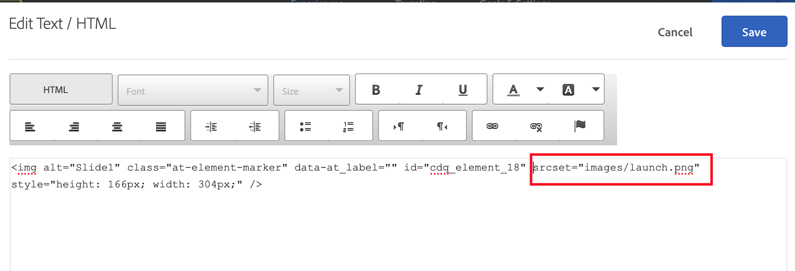

# El intercambio de imágenes no funciona correctamente en el VEC de Target

Explore la solución eficaz para los problemas de carga de imágenes en el VEC de Adobe Target.

## Descripción {#description}

<b>Entorno</b>

- Adobe Target

<b>Problema/Síntomas</b>

En Adobe Target VEC, después de intercambiar una imagen en una página a través del VEC de Adobe Target `>`  Reemplazar contenido `>`  Imagen, la imagen no se carga correctamente o, a veces, puede haber un icono de error en la ventana Modificaciones a la derecha de la ventana de edición de VEC.

## Resolución {#resolution}

Intente utilizar la acción de edición del HTML en el contenedor principal haciendo clic en el menú &quot;Expandir selección&quot; y reemplazando el valor del atributo srcset en el código del HTML.

<b>Causa</b>

La acción de intercambiar imagen en VEC se basa en el atributo src de la etiqueta img y no funciona en el atributo srcset.
