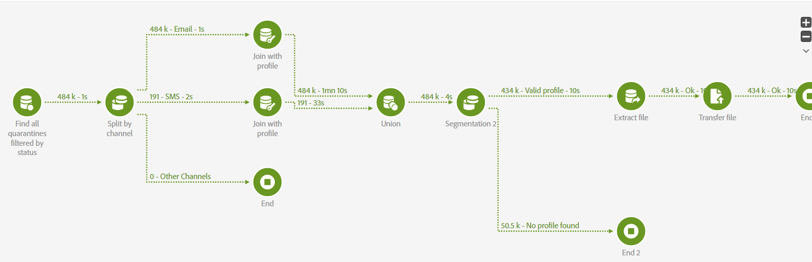

# Exportación de cuarentenas por país en Campaign Standard

Este artículo explica cómo vincular cuarentenas a perfiles en Adobe Campaign Standard.

## Descripción {#description}

### <b>Entorno</b>

Adobe Campaign Standard

### <b>Problema/Síntomas</b>

¿Cómo se pueden exportar cuarentenas por país?

## Resolución {#resolution}

- Cuarentenas en la tabla ``NmsAddressStatus``
   - Están vinculados a la última entrega, pero no a ningún perfil.
   - Contienen la dirección de destinatario &quot;normalizada&quot; (por ejemplo, minúsculas para correo electrónico / + prefijo para teléfono móvil).

- Existen dos opciones para vincularlos a perfiles:

1. Únase al perfil de a través del campo de dirección de la ``AddressStatus`` y Correo electrónico/teléfono móvil en el perfil.
   - Esto no devuelve los registros en los que la dirección no está normalizada en el nivel de perfil.
2. Únase al perfil buscando todos los registros de envío (también contienen direcciones de destinatario normalizadas).
   - Esto solo devolverá datos de los últimos 6 meses y nada para los rechazos graves más antiguos.
   - Esto devolverá perfiles en los que la dirección del destinatario ya se ha cambiado o corregido.

