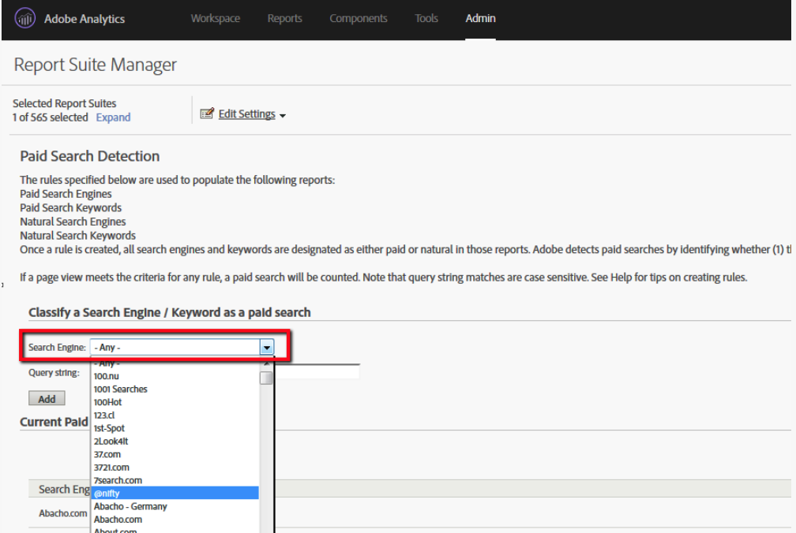

# ¿Cómo puedo obtener la lista de motores de búsqueda reconocidos por Adobe Analytics?

## Descripción

¿Cómo puedo obtener la lista de motores de búsqueda reconocidos por Adobe Analytics?
 

## Resolución

<b>Opción 1</b>

Puede consultar rápidamente los motores de búsqueda registrados en Adobe Analytics en el menú de [!UICONTROL detección de búsquedas de pago].

1. Inicie sesión en Adobe Analytics
2. [!UICONTROL Administración] » [!UICONTROL Grupos de informes] » [!UICONTROL Editar configuración] » [!UICONTROL Detección de búsqueda de pago]
3. Busque el [!UICONTROL motor de búsqueda] en la barra de desplazamiento desplegable

<b>Opción 2</b>

Puede obtener la lista de motores de búsqueda reconocidos por Adobe Analytics en el archivo &quot;search_engines.tsv&quot; de la carpeta lookup_data de una fuente de datos.
