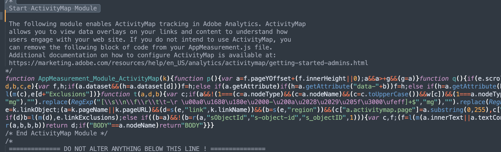

# ¿Cómo se desactiva la recopilación de datos de Active Map?

## Descripción

Por alguna razón, ya no queremos recopilar datos de Active Map; ¿cómo podemos deshabilitar la recopilación de datos de Active Map?
  

## Resolución

- <b>Si la biblioteca de Adobe Analytics se administra en un servidor del cliente (AppMeasurement.js autoalojado )</b>

Elimine el módulo AppMeasurement_Módulo_ActivityMap del archivo AppMeasurement.js

- <b>Si la biblioteca Adobe Analytics se administra en el lado del Adobe ( AppMeasurement.js alojado a través de la CDN de Adobe)</b>

En la IU de recopilación de datos (Launch) de AEP, vaya a la configuración de la extensión de Adobe Analytics y, para deshabilitar el Activity Map, desactive la casilla y, a continuación, publique la compilación

- 

- <b>Después de deshabilitar Active Map, compruebe que el módulo de Active Map no se carga a través del menú &quot;consola&quot; del explorador con el comando &quot;s_c_il&quot;</b>

Módulo de Active Map cargado

El módulo de Active Map no está cargado

- <b>Después de deshabilitar Active Map, compruebe la llamada al servidor de Adobe Analytics a través del menú &quot;red&quot; del explorador</b>.

