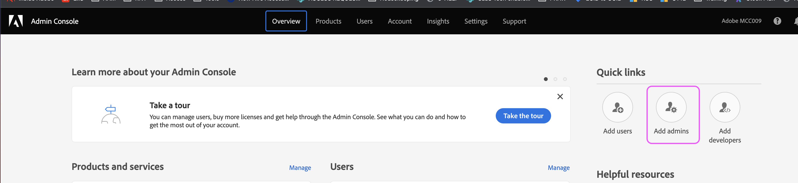
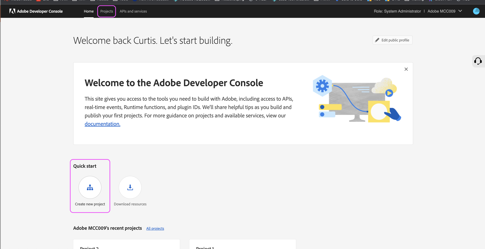

# AAM Configuración del acceso a la API de

Obtenga información sobre cómo crear un proyecto en Developer Console para generar credenciales de JWT de la API de Audience Manager.

## Descripción {#description}

### Entorno

Adobe Audience Manager

### Problema/Síntomas

¿Cómo se configuran y generan las credenciales para la API de Audience Manager?

## Resolución {#resolution}

Necesitará permisos de administrador del sistema en el Admin Console para poder generar credenciales para la API de Audience Manager. Los pasos 1 y 2 describen cómo conceder estos permisos escalados. Es posible que los administradores del sistema actuales prefieran seguir estos pasos ellos mismos en lugar de conceder permisos de administración escalados a un usuario adicional, en cuyo caso vaya directamente al paso 3.

1. Vaya a [Admin Console](https://adminconsole.adobe.com/) y seleccione &quot;Añadir administradores&quot; en el menú &quot;Enlaces rápidos&quot;:     
2. Introduzca los correos electrónicos de todos los usuarios a los que desea conceder acceso. En la página siguiente, seleccione &quot;Administrador del sistema&quot; para el nivel de permisos:     
3. Vaya a [https://developer.adobe.com/console](https://developer.adobe.com/console) . Si todavía no tiene acceso a pesar de que se le han concedido derechos de administración del sistema en los pasos anteriores, intente actualizar las cookies o la caché.
4. Cree un nuevo proyecto desde el menú de inicio rápido (o el menú de proyectos en la barra de navegación superior):     
5. Añada la API de Audience Manager al proyecto:     
   
6. Siga los pasos para generar (o cargar) sus credenciales de JWT. Si decide generar las credenciales a través de la consola de desarrollo, asegúrese de almacenar de forma segura la clave privada. Necesitará su clave privada en pasos posteriores.     
7. A continuación, se le pedirá que asigne las credenciales a perfiles de producto relevantes. Si su organización utiliza controles de acceso basados en funciones, deberá seguir estos pasos para crear una cuenta de usuario técnica y agregarla al grupo RBAC correspondiente: [https://experienceleague.adobe.com/docs/audience-manager/user-guide/api-and-sdk-code/rest-apis/aam-api-getting-started.html?lang=en#technical-account-rbac-permissions](https://experienceleague.adobe.com/docs/audience-manager/user-guide/api-and-sdk-code/rest-apis/aam-api-getting-started.html?lang=en#technical-account-rbac-permissions)
8. Una vez completados estos pasos, puede generar un token de acceso para realizar la primera solicitud de API. En primer lugar, haga clic en la página de información general de credenciales en la consola de desarrollo:     
9. Haga clic en la pestaña &quot;Generar JWT&quot; en la parte superior de la página, pegue la clave privada completa del archivo descargado en el paso 6 y haga clic en &quot;Generar token&quot;:     

Finalmente, puede realizar solicitudes de API utilizando el token de acceso recuperado en el paso anterior. Las llamadas se pueden realizar desde cualquier plataforma de API, como Postman, directamente a través de comandos cURL o incluso desde nuestra página de documentación de API: [https://bank.demdex.com/portal/swagger/index.html#/](https://bank.demdex.com/portal/swagger/index.html#/)

Para realizar llamadas utilizando las funciones de demostración de nuestra documentación, siga los pasos anteriores para generar su token y, a continuación, haga clic en &quot;Autorizar&quot; en la parte derecha de la página e introduzca su token:

Asegúrese también de seleccionar el servidor aam.adobe.io, tal como se indica en la captura de pantalla anterior. Ahora, puede utilizar la función de demostración en cualquiera de las solicitudes de API introduciendo los parámetros relevantes y haciendo clic en el botón &quot;Probar&quot;:

Tenga en cuenta que esto enviará una solicitud de API real a su instancia. Si utiliza una solicitud de DELETE, PUT o POST, es posible que esté realizando cambios no deseados en su instancia. Asegúrese siempre de leer cuidadosamente la documentación de cada una de estas llamadas a la API antes de enviar la solicitud.
