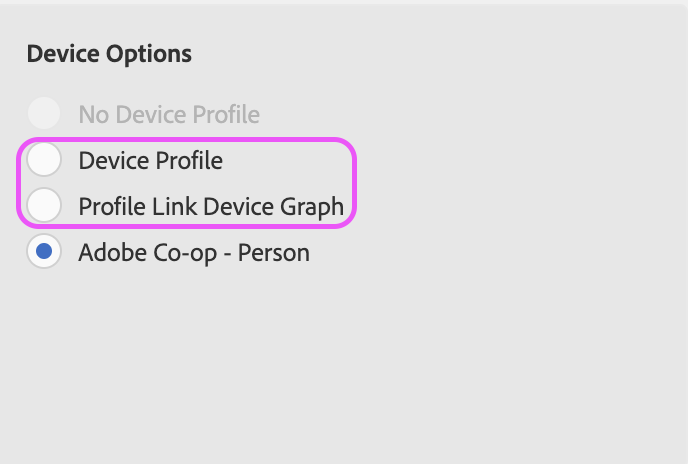

# Puesta de sol de Device Co-Op

A partir del 31 de agosto de 2022, la cooperación entre dispositivos quedará obsoleta oficialmente. Este artículo describe los impactos del usuario y los pasos necesarios.

## Descripción {#description}

### Entorno

Audience Manager

### Problema/Síntomas

A partir del 31 de agosto de 2022, la cooperación entre dispositivos quedará obsoleta oficialmente. Este artículo describe los impactos del usuario y los pasos necesarios.

## Resolución {#resolution}

El trabajo de desaprobación de la cooperación entre dispositivos comenzará el 31 de agosto de 2022. Aunque la opción de seleccionar la cooperación puede que no se elimine inicialmente de la interfaz de usuario, el gráfico del dispositivo de cooperación en sí se eliminará, por lo que cualquier población de segmentos que utilice la cooperación puede experimentar una disminución notable de tamaño. Recomendamos a todos los usuarios actualizar sus reglas de combinación de perfiles (PMR) antes del 31 de agosto de 2022.

Para actualizar los PMR, vaya a Datos de audiencia `>`  Reglas de combinación de perfiles y seleccione la regla en cuestión. En la parte inferior derecha de la página de información general de PMR, podrá actualizar la selección de opciones de dispositivo:

Seleccione &quot;Gráfico de dispositivos de enlace de perfil&quot; o &quot;Perfil de dispositivo&quot; para actualizar el PMR. Encontrará más detalles sobre las diferencias entre estas dos opciones aquí: [https://experienceleague.adobe.com/docs/audience-manager/user-guide/features/profile-merge-rules/merge-rule-definitions.html?lang=en#device-options](https://experienceleague.adobe.com/docs/audience-manager/user-guide/features/profile-merge-rules/merge-rule-definitions.html?lang=en#device-options)

Si tiene problemas o conflictos al intentar actualizar el PMR, lo más probable es que se deba a los segmentos adjuntos y a los controles de exportación de datos asociados. En este caso, se recomienda crear un nuevo PMR (póngase en contacto con los equipos de asistencia para proporcionar una nueva regla si está en el límite): [https://experienceleague.adobe.com/docs/audience-manager/user-guide/features/profile-merge-rules/merge-rules-start.html?lang=en#profile-merge-rule-setup](https://experienceleague.adobe.com/docs/audience-manager/user-guide/features/profile-merge-rules/merge-rules-start.html?lang=en#profile-merge-rule-setup)

Si el antiguo PMR de cooperación ya no se utiliza, puede eliminar la regla. Seleccione el PMR recién creado del paso anterior cuando se le dé la opción:

Como opción alternativa, la variable [Herramienta BAAAM](https://experienceleague.adobe.com/docs/audience-manager/user-guide/reference/bulk-management-tools/bulk-management-intro.html?lang=en) también se puede utilizar para actualizar todos los segmentos relevantes del antiguo PMR de cooperación a la regla recién creada: [https://experienceleague.adobe.com/docs/audience-manager/user-guide/reference/bulk-management-tools/bulk-management-intro.html?lang=en#actions-ops](https://experienceleague.adobe.com/docs/audience-manager/user-guide/reference/bulk-management-tools/bulk-management-intro.html?lang=en#actions-ops)

Los segmentos creados por un servicio, como las audiencias predictivas y las audiencias basadas en Experience Cloud (compartidas desde Analytics), no se pueden editar directamente en la interfaz de usuario ni mediante API. Si se produce un error al intentar eliminar el PMR y mover los segmentos, o si observa problemas con segmentos individuales dentro de la herramienta BAAAM, compile una lista de ID de segmento problemáticos y abra una incidencia con los equipos de asistencia. 

Después de actualizar las reglas como se ha descrito anteriormente, si desea eliminar la opción de cooperación de la interfaz de usuario, abra un ticket con la ayuda del equipo de asistencia y solicite que se elimine la cooperación entre dispositivos. Además, no dude en abrir un ticket con cualquier pregunta o preocupación general relacionada con este artículo o con la obsolescencia general de device co-op.

Consulte las preguntas frecuentes para obtener más información: [https://experienceleague.adobe.com/docs/device-co-op/using/about/device-co-op-eol.html?lang=en](https://experienceleague.adobe.com/docs/device-co-op/using/about/device-co-op-eol.html?lang=en)
