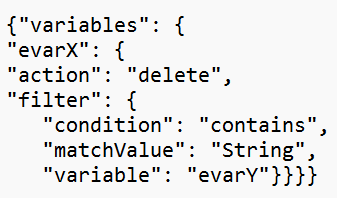

# API de reparación de datos: ¿cómo filtrar por una variable distinta a la de destino?

## Descripción {#description}

Los filtros compuestos se pueden utilizar en la API de reparación de datos. Por ejemplo, elimine evar3 cuando evar2=X.
  

## Resolución {#resolution}

La API de reparación de datos permite filtrar variables distintas de la variable de destino. Esto no está disponible para todos los clientes. Póngase en contacto con el Servicio de atención al cliente de Adobe para obtener más información.   <u><b>Sintaxis</b></u>:

<u><b>Nota</b></u>: En caso de que se vea un error relacionado con la sintaxis de la variable body, agregue el parámetro de encabezado content-type: application/json a la solicitud de API.