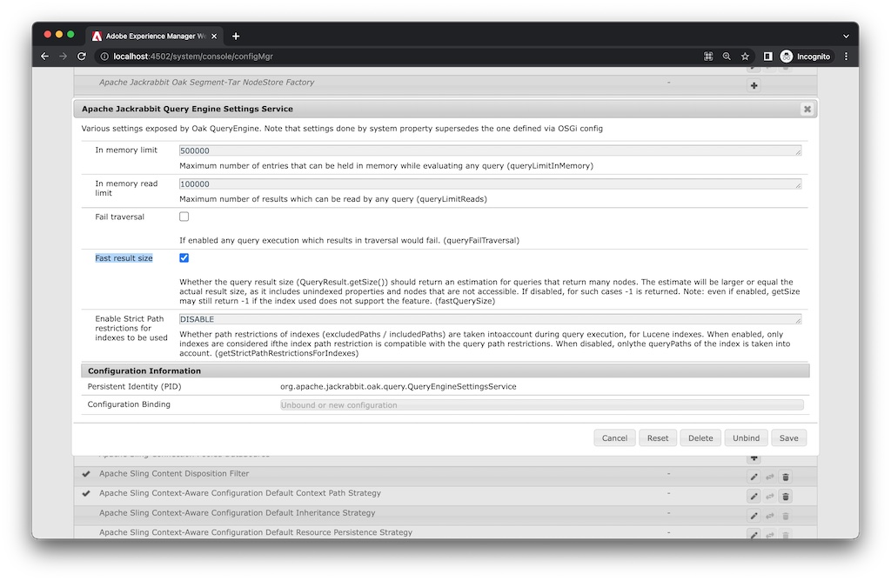

# Comprobar las configuraciones cuando el número de visitas parezca incorrecto

Obtenga información sobre cómo configurar `fastQuerySize` opción cuando el número real de resultados de búsqueda difiere del número de visitas para una consulta. Existen varias formas de habilitar la variable `fastQuerySize` opción. Este artículo explica cómo configurar cada forma.

## Descripción {#description}

### <b>Entorno</b>

Adobe Experience Manager (AEM)

### <b>Problema/Síntomas</b>

¿Cómo comprobar las configuraciones cuando el número de visitas parece incorrecto?

## Resolución {#resolution}

<b>Configuración de OSGi</b>:Consola web > Configuración > Apache Jackrabbit Query Engine Settings Service > Tamaño de resultado rápido

`http://localhost:4502/system/console/configMgr/org.apache.jackrabbit.oak.query.QueryEngineSettingsService`
    Marque <b>Tamaño de resultado rápido</b> y Guardar.
   

<b>Configuración de Java</b>:`-Doak.fastQuerySize=true`

AEM Agregue la propiedad del sistema a continuación en el script de inicio de la (crx-quickstart/bin/start).
        `CQ_JVM_OPTS="${CQ_JVM_OPTS} -Doak.fastQuerySize=true"`

Esta configuración anula la configuración de OSGi.
    

<b>JMX</b>:Consola web > JMX > org.apache.jackrabbit.oak: configuración (QueryEngineSettings)

`http://localhost:4502/system/console/jmx/org.apache.jackrabbit.oak%3Aname%3Dsettings%2Ctype%3DQueryEngineSettings`
    Cambiar <b>Tamaño de resultado rápido</b> hasta *true* y <b>Guardar</b>.

Este valor de configuración en JMX anula otras configuraciones. AEM Al reiniciar el, se restablece el valor.

