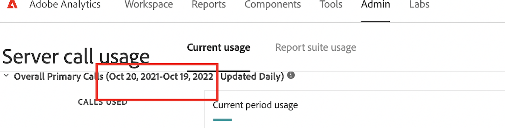

# El período de fecha de la IU de uso de llamada al servidor y el contrato no coinciden

## Descripción {#description}

### <b>Entorno</b>

Analytics

### <b>Problema/Síntomas</b>

¿Por qué el período de fecha en la IU de Uso de llamadas al servidor y la fecha en el contrato no coinciden?

Por ejemplo, en el contrato de Adobe Analytics el periodo de fecha es del 20/10/2021 ~ 19/01/2023.

Sin embargo, en la IU de Uso de llamadas al servidor el periodo de fecha es del 20/10/2021 ~ 19/10/2022.

<b></b>

## Resolución {#resolution}

Funciona según lo diseñado. El período de fecha de la IU de uso de llamada al servidor depende de los meses del ciclo de confirmación, no de las fechas de inicio/finalización del servicio del contrato.

Los meses del ciclo de compromiso del cliente anterior se facturan con incrementos de 12 meses. Cuando este ciclo de compromiso finalice el 19/10/2022, su siguiente ciclo de compromiso será de tres meses y finalizará el 19/01/2023.
