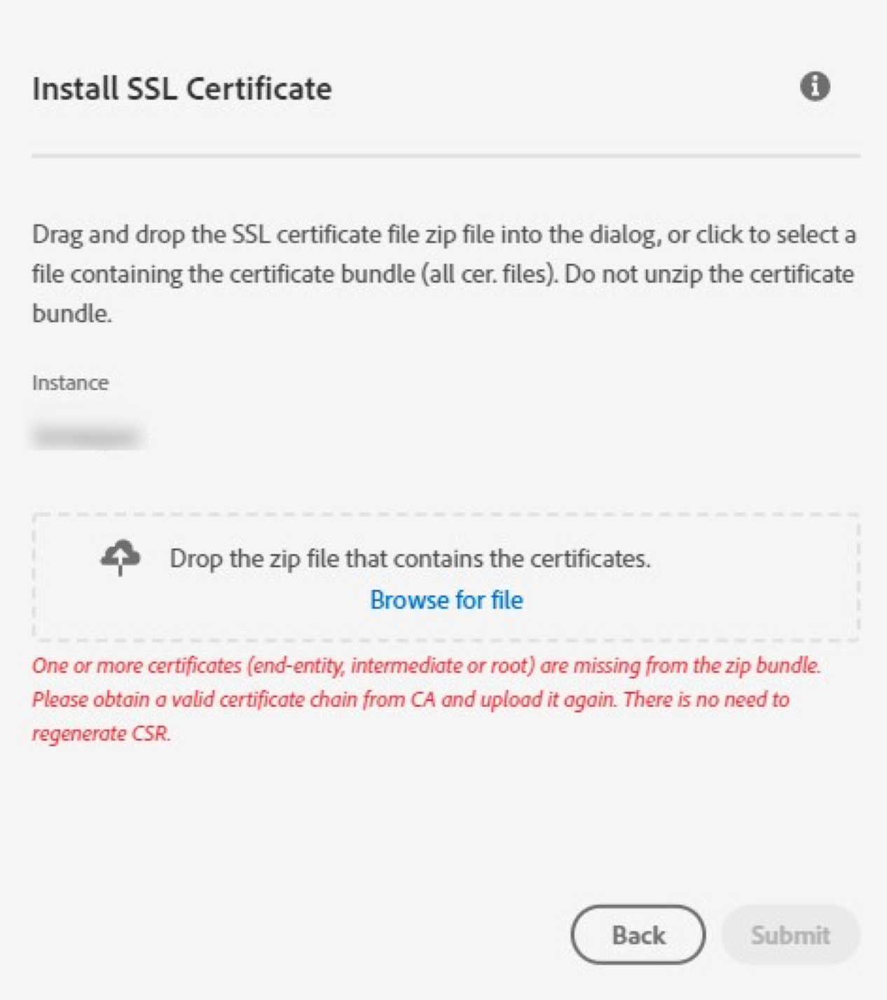

# Faltan certificados de Adobe Campaign en el paquete zip

## Descripción {#description}

<b>Entorno</b>
Adobe Campaign
<b>Problema/Síntomas</b>
Los certificados SSL han caducado o están a punto de caducar para algunos dominios. Sin embargo, cuando intenta cargar un certificado SSL para la solicitud de firma de certificado (CSR) generada a través del Panel de control de Campaign para su organización, aparece el siguiente error: *Faltan uno o más certificados (entidad final, intermedia o raíz) del paquete zip. Obtenga una cadena de certificados válida de CA y cárguela de nuevo. No es necesario regenerar la CSR*.

## Resolución {#resolution}

Sin la cadena completa de certificados de confianza, no puede renovar los certificados SSL. Solicite a la entidad emisora de certificados (CA) que proporcione el paquete zip que contiene todos los certificados y que pueda cargar los certificados mediante el Panel de control de Campaign .  Sin embargo, si esto es urgente (el tiempo, los envíos y los envíos de campaña se ven afectados), haga lo siguiente para &#x200B; &#x200B; &#x200B; &#x200B; recuperar &#x200B; recuperar el certificado intermedio que falta del certificado principal:

1. Vaya a las propiedades del certificado, vaya a la ruta del certificado y seleccione el certificado de firma.
2. Después, debe poder recuperar el certificado intermedio utilizando la variable <b>Copiar a archivo</b> .
3. Una vez descargado el certificado que falta, guárdelo en el paquete existente e intente cargar el certificado SSL a través del Panel de control de Campaign.

Los certificados SSL deberían haberse instalado para los dominios. Si los pasos anteriores no han funcionado, conecte con la CA.
