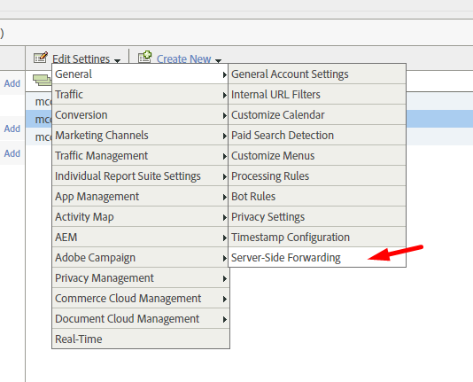

# Eliminación de las llamadas al Audience Manager

Este artículo proporciona los pasos para eliminar todas las llamadas al servidor o flujos de datos en Audience Manager.

## Descripción {#description}

### Entorno

Audience Manager

### Problemas/Síntomas

¿Cómo eliminar todas las llamadas al servidor o los flujos de datos en Audience Manager?

## Resolución {#resolution}

Puede quitar Audience Manager por completo eliminando su  de estos lugares:

- Eliminar el código DIL
- Eliminar el reenvío del lado del servidor en la biblioteca de Adobe Analytics
- Cancelar la publicación de todos los segmentos de Analytics
- Detención de los flujos de trabajo de importación y exportación en Adobe Campaign
- Detención de llamadas de Adobe Target
- Detención de la ingesta de registros DCM, llamadas de píxeles de terceros
- Detención de todos los destinos que comparten datos con cualquier segundo o tercero
- Deteniendo todas las ingestas de datos sin conexión

<b>Eliminación del código DIL</b>

1. En el código, identifique las siguientes funciones y elimínelas:

   1. DIL.create
   2. DILinstance.api.signals().submit()
   3. DIL.modules.siteCatalyst.init `[` Si reenvía datos a Adobe Analytics`]`
   4. GA.submitUniversalAnalytics(); O GA.submitUniversalAnalytics();  `[` Si reenvía datos a Google Analytics`]`
2. Una vez que haya eliminado la función anterior, asegúrese de haber eliminado también la biblioteca JS de DIL de su código.

<b>Resultado</b>: Volver a publicar y cargar el sitio web. NO debería ver ninguna llamada como https://subdomain.demdex.net/event?....

<b>Eliminación del reenvío del lado del servidor</b>

1. Vaya a los grupos de informes de Analytics que están habilitados para el reenvío del lado del servidor y deshabilite la casilla de verificación.

 

1. Una vez completado el paso anterior, vaya al código AppMeasurement.js y elimine el código que ve a continuación. Si tiene Launch, simplemente anule la selección de la casilla de verificación de reenvío de Audience Manager.

             

<b>Resultado</b>: la respuesta de llamada de Analytics debe estar vacía.

<b>Cancelar la publicación de todos los segmentos de Analytics</b>
Vaya a los segmentos individuales de Analytics que se publiquen y cancele la publicación.
<b>Resultado</b>: El uso compartido de segmentos sin conexión se detendrá de Analytics a Audience Manager.

<b>Detención de los flujos de trabajo de importación y exportación en Adobe Campaign</b>
Desde Audience Manager: Elimine todos los destinos de campaña
Desde Campaign: Elimine o detenga por completo los flujos de trabajo de importación y exportación desde la interfaz de usuario de Campaign.
<b>Resultado</b>: Se detendrán los segmentos que van de Audience a Campaign.

<b>Detención de llamadas de Adobe Target</b>
Póngase en contacto con su equipo de cuenta de Adobe para que el equipo de aprovisionamiento deshabilite la función &quot;Audiencias compartidas&quot; o &quot;Servicios principales de personas&quot;.
<b>Resultado</b>: Target no realizará llamadas adicionales al Audience Manager.

<b>Detención de la ingesta de registros DCM, llamadas de píxeles de terceros</b>
Si tiene habilitada la incorporación de registros de DCM, haga que se detenga y no cargue ningún archivo de metadatos adicional.
Si tiene algún píxel de impresión/clic/conversión activo en cualquier lugar, haga que también se detengan.
<b>Resultado</b>: No hay recopilación de datos de terceros.

<b>Detención de todos los destinos que comparten datos con cualquier segundo o tercero</b>
Los destinos de URL y cookies se pueden detener directamente desde la interfaz de usuario.
Para destinos S2S, puede ponerse en contacto con el servicio de asistencia para detener los destinos por completo.
<b>Resultado</b>: no se compartirán datos fuera del Audience Manager.

<b>Deteniendo todas las ingestas de datos sin conexión</b>
Si está cargando archivos de datos en Audience Manager, detenga dichos archivos inmediatamente.
<b>Resultado</b>: No se cargarán datos sin conexión.
