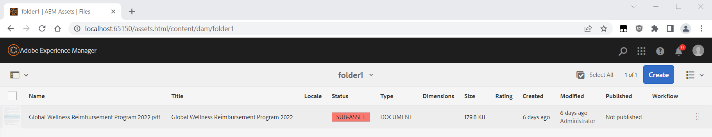

# Se muestra el estado de SUB-ASSET para el recurso

## Descripción {#description}

Al examinar el recurso, algunos recursos muestran un estado &quot;SUBRECURSO&quot;:

¿Qué significa esto? 

## Resolución {#resolution}

La variable <b>*SUBRECURSO</b>* el estado se corresponde con cuando el recurso tiene <b>activos relacionados</b> para los que *Digital Rights Management* fecha de vencimiento.

Este es un caso específico de la situación en la que el recurso principal en sí caducó, documentado aquí:

[https://experienceleague.adobe.com/docs/experience-manager-65/assets/administer/drm.html?lang=en#asset-expiration](https://experienceleague.adobe.com/docs/experience-manager-65/assets/administer/drm.html?lang=en#asset-expiration)

Para comprobar qué recurso relacionado ha caducado, abra las propiedades del recurso *Básico* y observe la *indicador rojo* icono:

La variable <b>activos relacionados</b> se trata de dos tipos:

<u><b>#1 - El recurso es un PDF con subpáginas</b></u>

Si ha modificado su &quot;Activo de actualización de DAM&quot; para extraer páginas de su PDF, creará un subrecurso para las páginas del documento.

Cada página extraída es un recurso, almacenado en el recurso principal, en un subnodo o carpeta denominado &quot;/subactivos&quot; y tiene propiedades de metadatos, incluido DRM *Caduca* en la *Avanzadas* pestaña .

Si *Caduca* fecha en la que ha pasado, verá:

- el <b>*CADUCADO</b>* estado de esta subpágina/recurso al explorar los subrecursos del PDF principal (mediante el carril superior izquierdo, cambie de *Solo contenido* ver *Subrecursos*)
- el <b>*SUBRECURSO</b>* estado al volver al PDF principal

Esto se documenta en la siguiente página 0.

<u><b>#2 - El recurso tiene recursos de referencia</b></u>

Para cualquier tipo de recurso, es posible hacer referencia a otros activos. La variable <b>*SUBRECURSO</b>* también se calcula mirando la *Caduca* fecha de cada una de estas referencias.

Estas referencias se almacenan en una propiedad:

*asset/jcr:content/related/links/sling:Members/sling:resources*

<u>Nota:</u>

En el caso de que el recurso tenga demasiadas referencias (varios miles), podría causar algunos problemas de rendimiento de la interfaz de usuario al intentar mostrar las propiedades del recurso.

Comprobar/calcular el estado de todas esas referencias puede llevar demasiado tiempo, y se agotará el tiempo de espera de la solicitud para abrir las propiedades.

Tener demasiadas referencias es preocupante y debe investigarse, ya que puede causar problemas de rendimiento:

[https://jackrabbit.apache.org/oak/docs/dos_and_donts.html#Large_Multi_Value_Property](https://jackrabbit.apache.org/oak/docs/dos_and_donts.html#Large_Multi_Value_Property)

Para solucionar el problema, si estas referencias relacionadas no aportan ningún valor, se puede eliminar la siguiente carpeta/subnodo de CRX/DE:

*/content<b>t</b>/.../asset/jcr:content/related/links*

<u><b>#3 - Sugerencias para comprobar los recursos caducados</b></u>

Puede utilizar la siguiente consulta JCR SQL2 para enumerar todos los activos del repositorio que tengan una fecha de caducidad alcanzada:

*SELECT \* FROM dam:Asset WHERE jcr:content/metadata/prism:expirationDate cast(&#39;2023-01-02T17:00:00,000Z&#39; como fecha)*

Cambie la fecha a la hora actual (en formato GMT).
