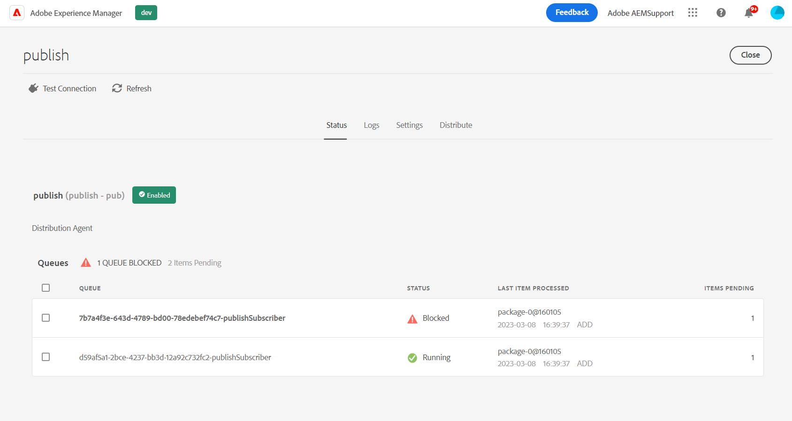

# Cola de distribución bloqueada con AccessDeniedException

## Descripción {#description}

<b>Entorno</b>
- Experience Manager
- Experience Manager as a cloud service

<b>Problemas/Síntomas</b> Cuando se intenta replicar algún contenido de página (o XF y otro tipo de recursos) utilizando &quot;Publicación rápida&quot;, &quot;Administrar publicación&quot; o &quot;Replicar&quot;, se obtiene la cola de distribución en Autor <b>Bloqueado</b>.   Esto se puede observar comprobando la variable *publicar* Cola de distribución desde la interfaz de usuario de distribución (AEM - Herramientas - Implementación - Distribución):    Seleccionar la cola de Golden Publisher (entrada en negrita de la lista), se proporcionan más detalles y, en particular, los <b>RUTA</b> (aquí puede haber varios elementos):    Consulte <b>Registros</b> mostrará el siguiente error correspondiente: 2023/03/08 12:11:26:238 - INFO - Solicitud aceptada con el paquete de distribución PackageMessage(pubSlingId=a1133c97-6809-411e-a435-4eea0ecbe889, reqType=ADD, pkgId=dstrpck-1 678277486031-63159f4b-c577-4079-8741-d41660597d20, pkgType=journal_filevault, pkgLength 6330, pubAgentName=publish, userId=replication-service, paths=/content/wknd/fr, deepPaths=) en offset=158705 2023/03/08 12:11:27:459 - ADVERTENCIA - Mensaje: Error al intentar importar el paquete de distribución PackageMessage(pubSlingId=a1133c97-6809-411e-a435-4eea0ecbe889, reqType=ADD, pkgId=dstrpck-1678 277486031-63159f4b-c577-4079-8741-d41660597d20, pkgType=journal_filevault, pkgLength=633 0, pubAgentName=publish, userId=replication-service, paths=/content/wknd/fr, deepPaths=) en offset=158705 debido a &#39;javax.jcr.AccessDeniedException: OakAccess0000: Acceso denegado&#39;, el importador lo volverá a intentar más tarde, Stacktrace: org.apache.sling.distribution.common.DistributionException: javax.jcr.AccessDeniedException: OakAccess0000: Acceso denegado ..   Debe *Borrar cola* (o quitar ese elemento) para desbloquear la cola.

## Resolución {#resolution}

A pesar del error <b>`javax.jcr.AccessDeniedException`</b>, es posible que no haya relación con la ACL/permisos para los usuarios del servicio de distribución, aunque esto debe tenerse en cuenta si el siguiente escenario no se aplica a su caso.

Diagnóstico

El error anterior puede ocurrir en alguna situación, cuando el contenido replicado tiene una configuración específica relacionada con el especial <b>jcr:lockIsDeep</b> propiedad.

Para confirmar el diagnóstico, deberá inspeccionar <b>cada una de las rutas mencionadas</b> con cualquiera de las siguientes herramientas a las que puede acceder o es aplicable:

1. CRX/DE para instancias DEV
2. el [Explorador del repositorio](https://experienceleague.adobe.com/docs/experience-manager-cloud-service/content/implementing/developer-tools/repository-browser.html?lang=es)
3. creación de un paquete de contenido en el Administrador de paquetes (esta opción también forma parte de la resolución)

A continuación, debe comprobar la variable <b>`jcr:content`</b> para cada ruta encontrada en la interfaz de usuario de la cola de distribución y compruebe si:

- It <b>does </b>tienen un <b>`jcr:lockIsDeep`=&quot;(Boolean)true&quot;</b> property
- It <b>no </b>tienen un <b>`jcr:lockOwner="xxx"`</b> property
- <b>(</b>it <b>no</b> tienen un <b>`mix:lockable`</b> en la variable <b>`jcr:mixinTypes`</b>)

Si este es el caso, el problema se confirma, ya que la variable <b>`jcr:lockIsDeep`</b> no debe estar presente solo. Esta propiedad siempre debe establecerse junto con la variable <b>`jcr:lockOwner`</b> when <b>Bloqueo</b> una página.

No es posible configurar solo la variable <b>`jcr:lockIsDeep`</b> , incluso usando la API de JCR, por lo que la causa principal que explica esta situación es principalmente haber instalado un paquete de contenido &quot;dañado&quot; con esa única propiedad.

<u><b>Resolución</b></u>

Para corregir el contenido, la única solución es instalar un paquete en su Autor que tenga las propiedades correctas establecidas en el nodo correspondiente.

Puede crear ese paquete desde otra instancia que tenga el contenido correspondiente o si solo tiene este contenido en la instancia afectada, puede seguir estas instrucciones:

1. generar un paquete en una instancia dañada para la página defectuosa
2. descargar el paquete
3. extraer el <b>`.content.xml`</b> para la página/jcr:content
4. elimine manualmente la línea con el <b>jcr:lockIsDeep</b>
5. actualice el paquete con el nuevo/fijo .content.xml
6. volver a cargar e instalar el paquete modificado

A continuación, puede comprobar de nuevo las propiedades de la página y probar correctamente la replicación/distribución.
