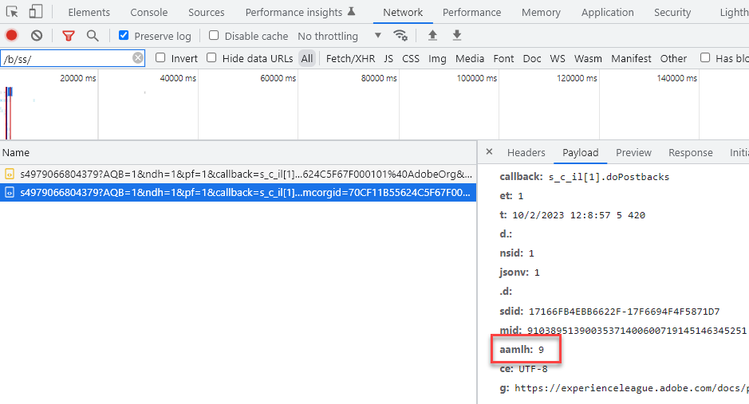

# Sugerencias de ubicación de Experience Platform AAM, nodos regionales de DCS de y sugerencias de ubicación del servicio de ID

## Descripción {#description}

¿Cuál es la relación entre las sugerencias de ubicación de WebSDK de AEP, las sugerencias de ubicación del servicio de ID de Experience Cloud AAM y los nodos regionales de DCS de y por qué es importante comprender esta relación?

## Resolución {#resolution}

El SDK web de AEP (que envía datos a Experience Edge) y la recopilación de datos en tiempo real de Adobe Audience Manager AAM () se producen en nodos regionales dispersos por todo el mundo. AAM Hay 7 nodos regionales diferentes y el SDK web de AEP/Experience Edge y la recopilación de datos de la aplicación de datos de la aplicación de datos de la aplicación de datos utilizan los mismos nodos. AAM Los servidores de recopilación de datos (DCS) utilizan la misma infraestructura de red que conforma Experience Edge. Del mismo modo, dado que el servicio de ID de Experience Cloud AAM AAM utiliza tecnología de, las sugerencias de ubicación del servicio de ID son las mismas que las de los nodos de recopilación de datos regionales de la. AAM En otras palabras, nodos DCS de = Sugerencias de ubicación del servicio de ID = Sugerencias de ubicación de Experience Edge. AAM En esta sección se describen los nodos regionales de la [documentación](https://experienceleague.adobe.com/docs/audience-manager/user-guide/api-and-sdk-code/dcs/dcs-api-reference/dcs-regions.html?lang=en), mientras que los nodos regionales de Experience Edge se describen en esta sección [documentación](https://experienceleague.adobe.com/docs/experience-platform/edge-network-server-api/location-hints.html?lang=en).

AAM Aunque los nodos regionales de la aplicación y las sugerencias de ubicación del servicio de ID se identifican con números y las de Experience Edge se identifican con caracteres alfanuméricos, observará que todas se alinean con las mismas áreas (excepto Brasil).  La siguiente tabla de búsqueda muestra cómo se alinean:

| Sugerencia de ubicación de Experience Edge | AAM Sugerencia de ubicación del servicio de ID/nodo de región de DCS |
| --- | --- |
| spg3 | ID: 3 Host: apse.demdex.net |
| irl1 | ID: 6 Host: irl1.demdex.net |
| va6 | ID: 7 Host: use.demdex.net |
| aus3 | ID: 8 Host: apse2.demdex.net |
| or2 | ID: 9 Host: usw2.demdex.net |
| jpn3 | ID: 11 Host: tyo3.demdex.net |
| ind1 | ID: 12 Host: ind1.demdex.net |

La mayoría de las funciones de Adobe Experience Cloud que requieren una respuesta en tiempo real utilizan estos nodos regionales. La primera llamada en una página web o aplicación móvil al servicio de ID o Experience Edge determina qué nodo regional utilizar. Las sugerencias de ubicación se pueden encontrar en la respuesta a estas llamadas:

Servicio de Experience Cloud ID:

SDK web de AEP:

Una vez determinado el nodo regional más cercano al usuario final, el identificador de región se pasa a las llamadas de Analytics, Target y SDK web de AEP a partir de ahora. En Analytics, se pasa como parámetro de cadena de consulta aamlh:

En Target, se pasa en el objeto experienceCloud.audienceManager.locationHint de la carga útil de solicitud:

Para el SDK web de AEP, la ruta de la llamada se actualiza para reflejar el nodo regional:

<b>Nota: </b>La primera llamada de interacción desde AEP WebSDK NO tendrá la región en la ruta porque la región aún no se ha determinado, pero estará en la respuesta (como se ha indicado anteriormente). La ruta simplemente se ..../ee/v1/.... Sin embargo, las llamadas posteriores incluirán la información del nodo regional entre los elementos de ruta /ee/ y /v1/

AAM Estos parámetros garantizan que los datos de Analytics reenviados del lado del servidor se reenvíen al nodo perimetral correcto de la aplicación, que Target solicite información de segmentos desde ese mismo nodo perimetral y que [AAM Los datos de AEP envían datos a los](https://experienceleague.adobe.com/docs/audience-manager/user-guide/implementation-integration-guides/integration-experience-platform/aam-aep-audience-sharing.html?lang=en)(y la biblioteca de audiencias) corrigen el nodo regional.

Esta información es importante tenerla en cuenta a la hora de enviar visitas del lado del servidor o del lado del cliente de formas no estándar a las soluciones de Adobe. Por ejemplo, una llamada al SDK web construida manualmente en una página únicamente para sincronizar un ECID con un perfil de AEP debe enviarse al nodo regional de Experience Edge correcto. AAM AAM AAM AAM Si no es así, los datos compartidos desde AEP a la base de datos de back-end y, a continuación, tardarán 48 horas adicionales para que los datos se inserten en cada nodo perimetral, lo que ralentiza drásticamente el tiempo en el que Target podría utilizar cualquier segmento de AEP enviado a la base de datos de. AAM O si se envía una solicitud de Analytics del lado del servidor al nodo 7, pero la implementación de Target en la página del usuario utiliza la región 9, los datos se reenviarán al nodo Este de EE. UU., mientras que Target hace ping en el nodo Oeste de EE. UU. para obtener información sobre los segmentos. AAM El usuario final no podría cumplir los requisitos para ninguna actividad de Target que use segmentos o audiencias de la biblioteca de audiencias hasta que los nodos finales se sincronicen de 24 a 48 horas después. Es una práctica estándar en casos de uso como estos obtener el ECID usando el [getMarketingCloudVisitorID](https://experienceleague.adobe.com/docs/id-service/using/id-service-api/methods/getmcvid.html?lang=en) (servicio de ID) o [getIdentity](https://experienceleague.adobe.com/docs/experience-platform/edge/extension/accessing-the-ecid.html?lang=en) Funciones de (SDK web). Sin embargo, además de obtener el ECID, la sugerencia de ubicación también debe recuperarse y utilizarse utilizando el [getLocationHint](https://experienceleague.adobe.com/docs/id-service/using/id-service-api/methods/getlocationhint.html?lang=en) (Servicio de ID) o recuperándola de la carga útil de respuesta de las llamadas del SDK web.

