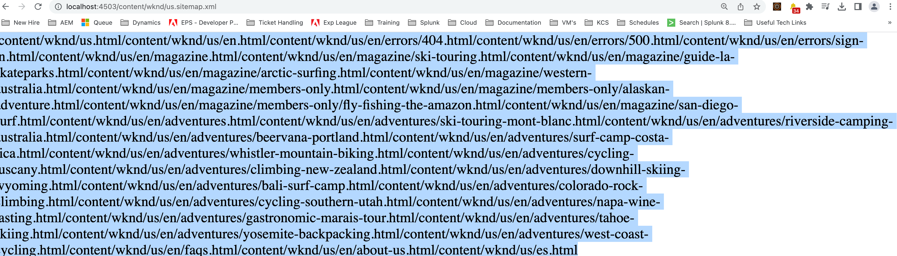

# Sitemap.xml no tiene el formato correcto

## Descripción {#description}

<b>Entorno</b>
Adobe Experience Manager as a Cloud Service

<b>Problema/Síntomas</b>
Al configurar el mapa del sitio según la documentación con la configuración predeterminada, no tiene el formato correcto (consulte la imagen adjunta como referencia).

## Resolución {#resolution}

Al utilizar el SDK local:

1. Vaya a <b>administrador de configuración</b> ([https://localhost:4502/system/console/configMgr](http://localhost:4502/system/console/configMgr%29 "Seguir vínculo")) y busque <b>Adobe AEM SEO: Generador de mapas de sitios de árbol de páginas</b> (com.adobe.aem.wcm.seo.impl.sitemap.PageTreeSitemapGeneratorImpl).

2. Abra el <b>config</b> y desmarque <b>Agregar alternativas de idioma</b>.

   <b>Nota: </b>Si está habilitado, las copias de idioma de una página se agregarán como alternativas de idioma a la entrada de URL<b> </b>(enableLanguageAlternates).

3. Guarde la configuración.

4. Vuelva a intentar el caso de uso.

Al utilizar un entorno de nube (que no sea SDK), establezca la configuración OSGI anterior en su repositorio Git e impleméntelo mediante una canalización.
