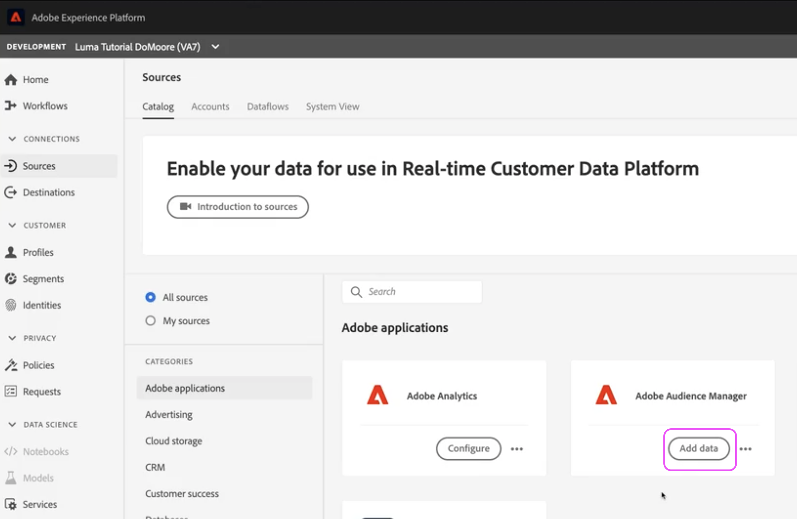

# Error: no se permite eliminar debido a que el uso compartido de segmentos está habilitado

AAM Obtenga información sobre cómo resolver el problema en el que intenta eliminar un rasgo o segmento en la (Adobe Audience Manager).

## Descripción {#description}

### <b>Entorno</b>

- Audience Manager
- Experience Platform

### <b>Problema/Síntomas</b>

AAM Este error se produce al intentar eliminar un rasgo o un segmento en la (Adobe Audience Manager). El motivo de este error es que el rasgo o segmento se comparte desde el Audience Manager a AEP (Adobe Experience Platform).

Los pasos que se indican a continuación ayudarán a resolver el siguiente error:&quot;*No se le permite eliminar debido a que el uso compartido de segmentos está habilitado&quot;*

## Resolución {#resolution}

Siga estos pasos: 

1. Vaya a <b>Fuentes</b> en AEP y abra la configuración del conector de origen del Audience Manager:

   

2. <b>Desmarcar</b> AAM los segmentos de los que está intentando eliminar el segmento o segmentos de los que está intentando eliminar el segmento de la lista de segmentos de la lista de segmentos

   
3. Una vez desmarcados los segmentos o rasgos, haga clic en <b>Siguiente</b> en la esquina superior derecha. En la página resultante, revise los cambios y haga clic en <b>Finalizado</b>.

AAM AAM Si comparte todos los segmentos y rasgos desde la segmentación de datos a AEP, debe actualizar la configuración para compartir segmentos específicos o dejar de compartir los datos para eliminar el segmento de.

