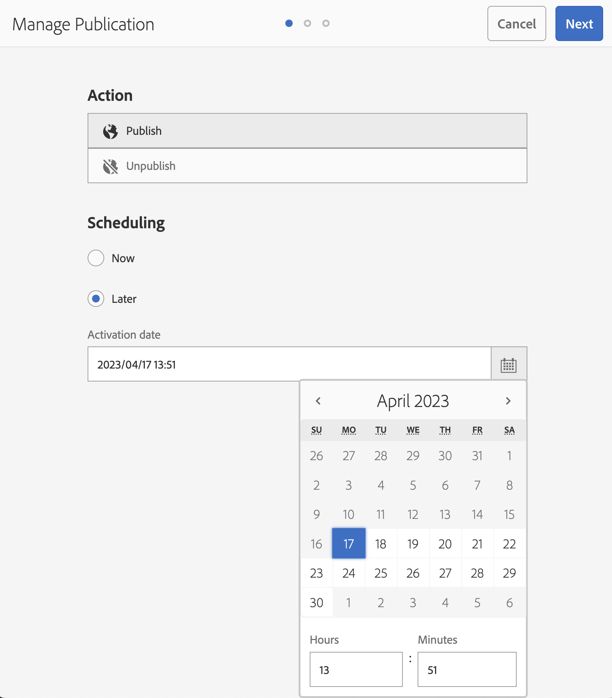

# Adobe Experience Manager: Personalización del formato de hora de la fecha de activación para Administrar publicación

## Descripción {#description}

En este artículo se explica cómo personalizar el formato de hora de la fecha de activación para Administrar publicación.      
<b>Entornos</b>
AEM 6.5

## Resolución {#resolution}

Cree un diccionario i18n para el idioma de destino. Los siguientes pasos personalizan el formato de hora para inglés de 12 horas a 24 horas.

Paso 1. Cree un formato de hora personalizado con la sintaxis de Moment.js (https://momentjs.com/docs/#/i18n/) en formato de 24 horas: &quot;2023/04/11 14:24&quot; &quot;AAAA/MM/DD HH:mm&quot;

Paso 2. Crear datos de diccionario con el CRXDE Lite

- Cree una carpeta i18n en el proyecto (/apps/wknd/i18n)
- Cree un archivo en.json en la carpeta i18n (/apps/wknd/i18n/en.json)
- Agregue las siguientes propiedades al nodo de archivo:
   - Nombre = jcr:mixinTypes, Tipo = Nombre, Valor = mix:language
   - Nombre = jcr:language, Tipo = Cadena, Valor = en
- Contenido del archivo: `{ "D MMMM YYYY hh:mm a" : "YYYY/MM/DD HH:mm" }`

Paso 3. Acceda a la pantalla Administrar publicación para comprobar el cambio El nuevo formato de hora puede reflejarse después de un período de tiempo debido a la caché del explorador

