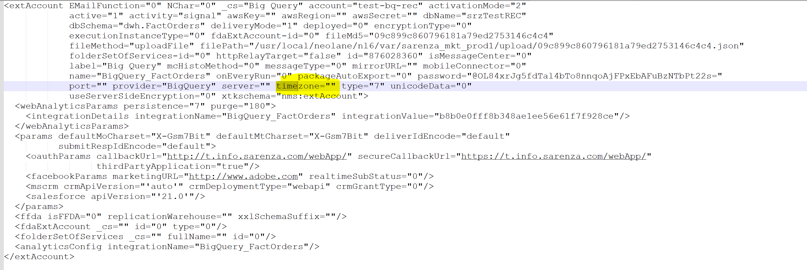

# Error: XSV-350064 en la cuenta externa de Google BigQuery

## Descripción {#description}

<b>Entorno</b> Campaign Classic v7   <b>Problema/Síntomas</b> Al intentar configurar la cuenta externa para <b>Google BigQuery</b> base de datos externa, cuando hacemos clic en probar conexión, obtenemos estos errores:
  XSV-350064: para acceder a bases de datos remotas, debe especificar la zona horaria de los datos XSV-350062: no se puede iniciar la fuente de datos    
<b>Pasos a seguir:</b>

- Vaya a la pestaña Cuentas externas.
- Haga clic en <b>Crear y elegir tipo</b> y seleccione <b>Big Query Google</b> y rellene todos los demás detalles.
- Haga clic en <b>Prueba de la conexión</b> y, a continuación, aparece un error.

## Resolución {#resolution}

Para restablecer el valor del campo `timezone`, debe cambiar el tipo a <b>PostgreSQL</b> (que tiene un *timezone* en la interfaz de usuario) y aquí puede elegir un valor y luego guardar la cuenta externa.

Después, cambie el tipo a <b>Google Big Query </b>vuelva a intentarlo, sustituya los datos antiguos y compruebe <b>Editar archivo XML</b> (ahora debería tener un valor para *timezone*).

Además, vuelva a probar la conexión y asegúrese de que no haya más errores con respecto a la zona horaria.

<b>Causa:</b>
Después de comprobar el archivo Editar XML, vimos que no hay ningún valor para *timezone* field (`timezone=""`)

