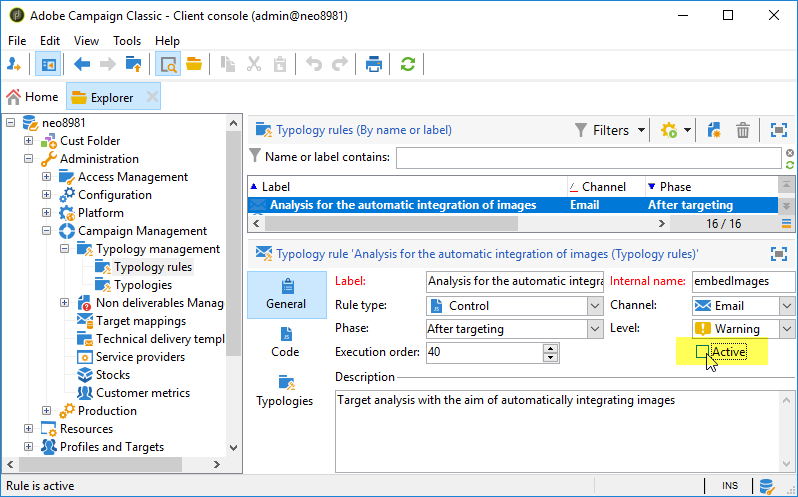

# ¿Cómo se evita la entrega lenta de correos electrónicos debido a los destinatarios de Deco-mail?

## Descripción {#description}

<b>Entorno</b>

- Adobe Campaign Classic (ACC)
- Adobe Campaign Standard (ACS)

<b>Problema/Síntomas</b>

Una entrega por canal de correo electrónico puede ser muy lenta si la población objetivo incluye destinatarios con la variable <b>Deco-mail</b> formatos de correo electrónico.

Un destinatario tiene un <b>Deco-mail</b> formato de correo electrónico en cualquiera de los siguientes casos o en ambos:

1. Su formato de correo electrónico se establece explícitamente en cualquiera de los siguientes valores:
   - Deco-mail (DoCoMo)
   - Decoration Mail (KDDI AU)
   - Decore Mail (Softbank)         
2. Su dominio de correo electrónico está configurado como `Image inclusion=yes`en:
   - <b>Campaign Management</b> › <b>Administración de no entregables</b> › <b>Administración del formato del mensaje</b>        

## Resolución {#resolution}

Para evitar este envío lento, intente lo siguiente:

- Limpie la población objetivo para que no incluya ningún destinatario de Deco-mail.
- Diseñe el flujo de trabajo que lo contiene para que excluya los destinatarios de Deco-mail de la población objetivo.
- Desactivar <b>Análisis para la integración automática de imágenes</b>.

   

<b>Causa</b>

Si el destinatario tiene un formato de correo electrónico de Decomail, Campaign aplica la regla de tipología: <b>Análisis para la integración automática de imágenes</b>. Convierte los vínculos de imagen del correo electrónico en el destinatario de Deco-mail en archivos de imagen adjuntos. El tamaño total de la entrega podría aumentar bastante y el rendimiento podría ralentizarse significativamente.
