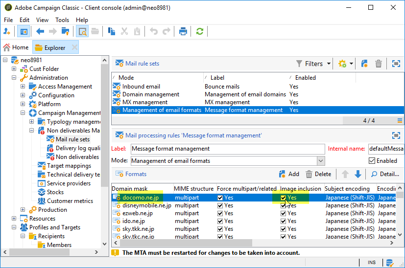

# ¿Cómo evitar una entrega de correo electrónico lenta debido a los destinatarios de Deco-mail?

## Descripción {#description}

<b>Entorno</b>

- Adobe Campaign Classic (ACC)
- Adobe Campaign Standard (ACS)

<b>Problema/Síntomas</b>

Una entrega por canal de correo electrónico puede ser muy lenta si la población de destino incluye destinatarios con la variable <b>Deco-mail</b> formatos de correo electrónico.

Un destinatario tiene un <b>Deco-mail</b> formato de correo electrónico en uno o ambos de los siguientes casos:

1. Su formato de correo electrónico se establece explícitamente en cualquiera de las siguientes opciones:
   - Deco-mail (DoCoMo)
   - Decoración Correo (KDDI AU)
   - Decorar correo (Softbank)         
2. Su dominio de correo electrónico está configurado como `Image inclusion=yes`en:
   - <b>Campaign Management</b> › <b>Gestión de no entregables</b> › <b>Administración de formato de mensaje</b>        

## Resolución {#resolution}

Para evitar esta entrega lenta, intente lo siguiente:

- Limpie la población de destino para que no incluya ningún destinatario Deco-mail.
- Diseñe el flujo de trabajo contenedor para que excluya los destinatarios de Deco-mail de la población objetivo.
- Desactivar <b>Análisis para la integración automática de imágenes</b>.

  

<b>Causa</b>

Si el destinatario tiene un formato de correo electrónico Deco-mail, Campaign aplica la regla de tipología: <b>Análisis para la integración automática de imágenes</b>. Convierte los vínculos de imagen del correo electrónico al destinatario Deco-mail en archivos de imagen adjuntos. El tamaño total de la entrega podría crecer bastante grande y el rendimiento podría ralentizarse significativamente.
