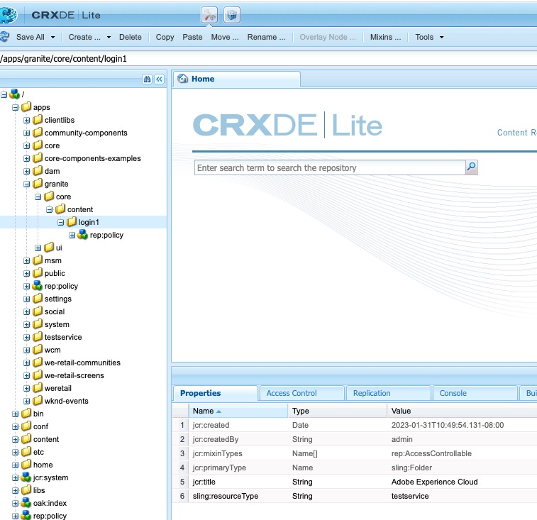

# Redireccionar a la página de inicio de sesión personalizada en caso de AEM error de flujo de OAuth

## Descripción {#description}

<b>Entorno</b>
Experience Manager

<b>Problema/Síntomas</b>
¿Cómo redirigir a la página de inicio de sesión personalizada en un entorno de publicación de Adobe Experience Manager (AEM) en caso de AEM error de flujo de autorización abierta (OAuth)?

## Resolución {#resolution}

En el caso del flujo de Lenguaje de marcado de aserción de seguridad (SAML)/OAuth, si hay un error en el flujo de autenticación de AEM, el sistema redireccionará a la página de inicio de sesión predeterminada predeterminada predeterminada AEM (OOTB).

Por lo tanto, es necesario redirigir a los usuarios a la página de inicio de sesión de IDP personalizada de SAML/OAuth. Siga los pasos que se indican a continuación:

1. Copiar esta ruta de acceso de nodo */libs/granite/core/content/login* a */apps/granite/core/content/login1* como se muestra a continuación.
2. Cambiar el tipo de recurso de */apps/granite/core/content/login1* a <b>testservice</b>, como se muestra a continuación:
3. Cree un `rep:policy` nodo bajo login1 con <b>permitir secundario</b>, como se muestra a continuación:
4. Cree un <b>testservice</b> carpeta en <b>/apps</b> y agregue <b>sling:resourceType</b> con <b>testservice</b> y crear un archivo JSP llamado <b>testservice.jsp</b>, como se muestra a continuación: (Nota: En caso de flujo de OAuth, asegúrese de anexar */j_security_check?configid=`<` oauth confiid respectivo`>`* a la ruta de redireccionamiento segura en el <b>JSP</b> más abajo)
5. Abra la configuración OSGI <b>Controlador de autenticación del selector de inicio de sesión de Adobe Granite</b> y cambiar la página de inicio de sesión predeterminada a */apps/granite/core/content/login1* y personalice el `auth.loginselector.mappings` para que apunte a mi página de inicio de sesión superpuesta para la ruta segura. Vea lo siguiente:
6. Abra la configuración OSGI <b>Servicio de autenticación Apache Sling</b> y agregue *-/apps/granite/core/content/login1* y *-/apps/testservice* a `sling.auth.requirements` lista. Vea lo siguiente:

