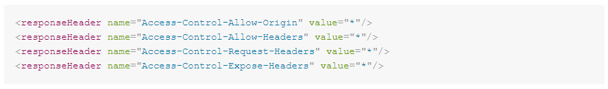

# Corregir errores al utilizar las extensiones .woff y .woff2?

## Descripción {#description}


### Entorno

Adobe Campaign Classic v7 (Versión 7.2.2, compilación 9349)

### Problema/Síntomas

Después de incluir en la lista blanca .woff y .woff2 en una instancia intermediaria y utilizar estas extensiones de archivo en una aplicación web, se genera el siguiente error:


```
Access to font at 'https://mkt-instance.campaign.adobe.com/res/mid-instance/file_example.woff2'
    from origin 'https://mkt-instance.campaign.adobe.com' has been blocked by 
    CORS policy: No 'Access-Control-Allow-Origin' header is present on the requested resource.
```


<u>Pasos a seguir</u>:

1. Acceda a la dirección URL de la aplicación web mediante los archivos .woff y .woff2.
2. Abra la consola del explorador web y observe el error de estos archivos.


## Resolución {#resolution}


1. Añadir `Access-Control-Allow-Origin`, `Access-Control-Allow-Headers`, y `Access-Control-Allow-Methods` como responseHeader en la sección de retransmisión de `serverConf.xml`:    
2. Añadir `Access-Control-Allow-Origin`, `Access-Control-Allow-Headers`, y `Access-Control-Allow-Methods` encabezados en `apache_neolane.conf` en ambos contenedores de aplicación:    
3. Una vez guardados los dos archivos, limpie nlserver y apache restart en todos los contenedores de la instancia.


### Causa

Se produce el error porque a la instancia media le faltaba la configuración de `Access-Control-Allow-Origin`, `Access-Control-Allow-Headers`, y `Access-Control-Allow-Methods` encabezados en `serverConf.xml` y el `apache_neolane.conf`.
