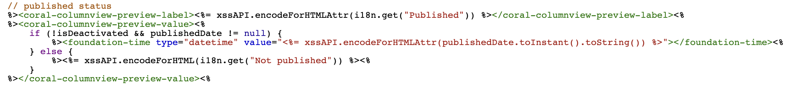
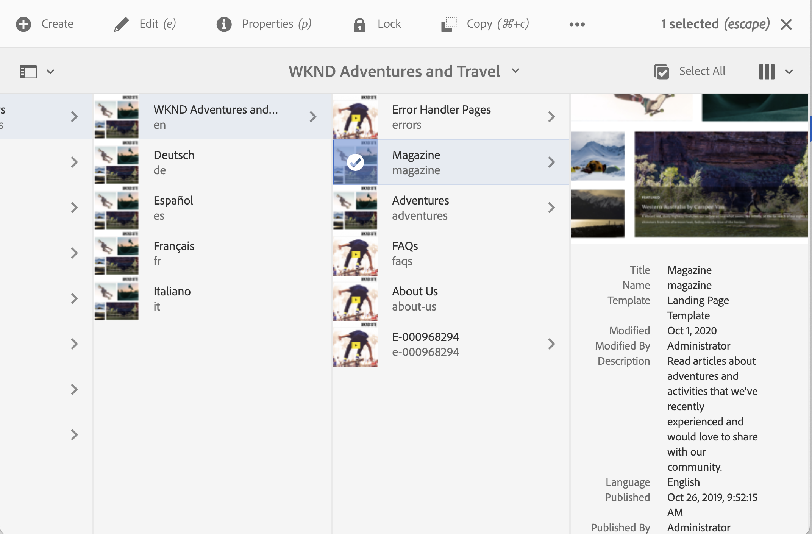

# Adobe Experience Manager: personalizar el formato de visualización de la fecha de publicación de la página en la consola Sitios

## Descripción {#description}

AEM La fecha de publicación de la página se muestra en la consola del sitio, pero no la hora del día.
En esta sección se explica cómo personalizar el formato de fecha y hora de la fecha de publicación para incluir la hora del día.

<b>Entornos</b>
AEM AEM.5, as a Cloud Service de la

## Resolución {#resolution}

Cree una superposición para cada una de las vistas de columna y lista.

Para la vista de columna, /libs/cq/gui/components/coral/admin/page/columnpreview/columnpreview.jsp está superpuesto.
  Antes de registrar los valores de

Después: agregue el atributo type=&quot;datetime&quot; a la etiqueta foundation-time.

Para la vista de lista, /libs/cq/gui/components/coral/admin/page/row/row.jsp está superpuesto.
  Antes de registrar los valores de

Después: agregue el atributo type=&quot;datetime&quot; a la etiqueta foundation-time.

