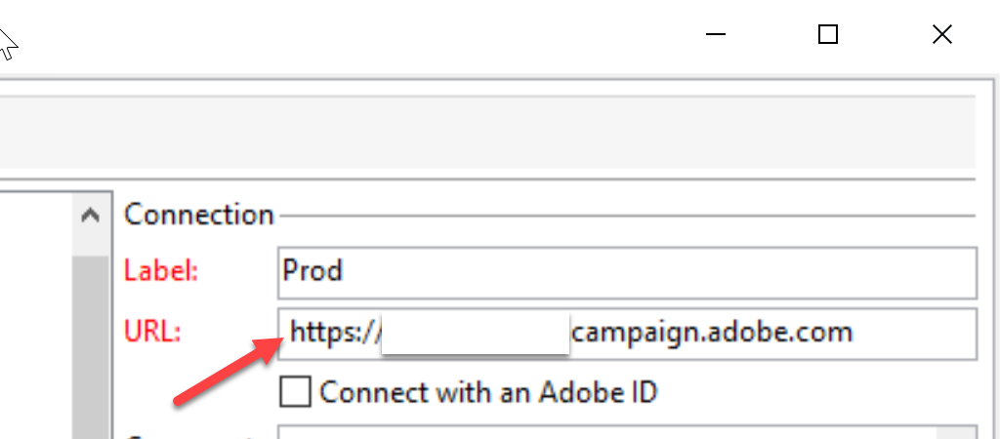

# Error: &quot;URL-140005 No se pueden descodificar las URL del esquema &quot; https&quot;. &quot;No implementado&quot;

## Descripción {#description}

### <b>Entorno</b>

Campaign Classic

### <b>Problema/Síntomas</b>

Se ha producido un error al iniciar sesión en una cuenta de ACC (Adobe Campaign Classic).

<b>Pasos a seguir:</b>

1. Abra la consola ACC.

2. Elija la conexión o la instancia en la que desea iniciar sesión.

3. En la página de inicio de sesión, aparece el siguiente error:

   `Error :"URL-140005 Unable to decode URLs of schema ' https'. Not implemented"`

## Resolución {#resolution}

Elimine el espacio existente delante del vínculo de instancia de la dirección URL de conexión.

### <b>Causa</b>

Existía un espacio antes de la dirección URL de instancia que se guardó en la conexión (consulte la captura de pantalla).

