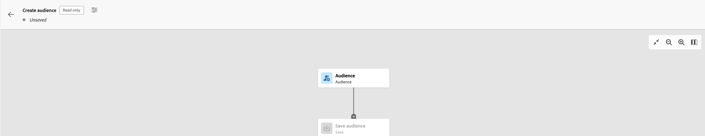

# AEP: Componer audiencia es de solo lectura. ¿Qué permisos necesitamos?

Al acceder a la sección Audiencias para componer una audiencia nueva, el proceso de creación muestra un indicador de solo lectura. ¿Qué acceso de permiso se requiere para eliminar ese indicador?

## Descripción {#description}

Al acceder a la sección Audiencias para componer una audiencia nueva, el proceso de creación muestra un indicador de solo lectura, como se muestra a continuación:

## Resolución {#resolution}

Para quitar el indicador de solo lectura, asegúrese de que los permisos de &quot;Administración de perfiles&quot; en AEP contengan el icono &quot;<b>Administrar políticas de combinación</b>&#39; privilegio - Esto resultará en la desaparición del indicador:

