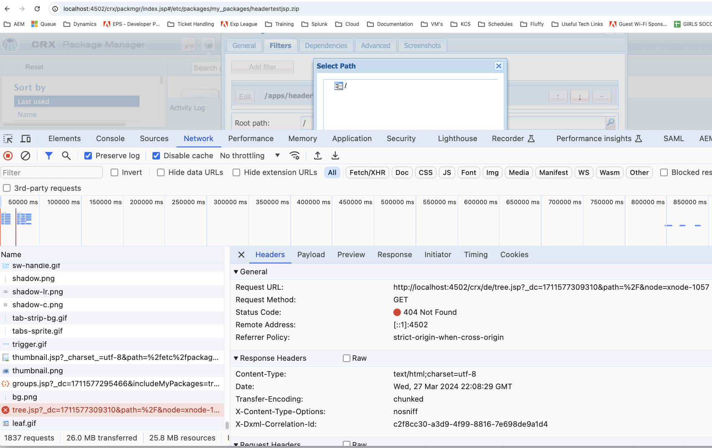

# No se pueden ver los subdirectorios en el Administrador de paquetes al crear nuevos filtros

En Adobe Experience Manager AEM (), los administradores pueden encontrar un problema en el que los subdirectorios no son visibles en la interfaz de usuario del Administrador de paquetes al intentar agregar nuevos filtros. Este artículo proporciona una resolución para los usuarios que necesitan crear paquetes que incluyan subdirectorios.

## Descripción {#description}

### Entorno

Adobe Experience Manager (AEM)

### Problema

AEM Al utilizar el Administrador de paquetes de para crear nuevos filtros para un paquete, la interfaz de usuario solo puede mostrar el directorio raíz, lo que impide la selección de subdirectorios.

Al inspeccionar esta ventana, puede ver en las herramientas para desarrolladores del explorador que el archivo /crx/de/tree.jsp no se encuentra.

También verá un error similar al intentar cargar la aplicación CRX/DE (por ejemplo, http://`<` hostname/crx/de/index.jsp).

Este comportamiento puede dificultar la capacidad de crear paquetes completos para su implementación o distribución.

## Resolución {#resolution}

Para resolver este problema, siga estos pasos:

1. Vaya a sus paquetes (http://localhost:4502/system/console/bundles).
2. Busque &quot;crx&quot;.
3. Asegúrese de que la variable [Adobe Granite CRXDE Lite (*com.adobe.granite.crxde-lite)*](http://localhost:4502/system/console/bundles/241) paquete en ejecución.
4. Vuelva a intentar el caso de uso.

Su CSE también puede habilitarlo temporalmente para usted.

<b>Nota:</b> La política de AMS es deshabilitar los paquetes CRX/DE en los sistemas de producción. Es crucial seguir las prácticas recomendadas de seguridad al habilitar CRX DE Lite en entornos de producción. El acceso debe restringirse a las tareas administrativas necesarias y el explorador debe desactivarse inmediatamente después de su uso.
